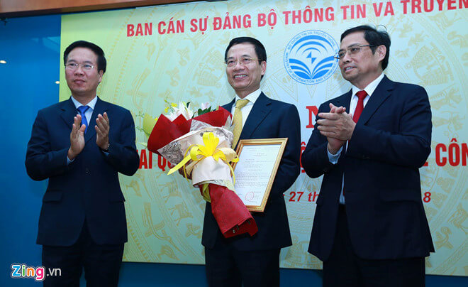

**Dưới góc nhìn của quyền Bộ trưởng Bộ TTTT  ông Nguyễn Mạnh Hùng, cách mạng công nghiệp lần thứ 4 đem lại nhiều cơ hội và chính quyền sẽ nhỏ hơn, thông minh hơn. Trong khi đó, người lao động sẽ có cơ hội cải thiện kỹ năng mềm và đặc biệt là cuộc cách mạng về tư duy.**

Quyền Bộ trưởng Bộ TTTT Nguyễn Mạnh Hùng là diễn giả đại diện Việt Nam tham gia vào phiên bế mạc Diễn đàn Kinh tế thế giới (WEF) về ASEAN. Ông Hùng được giới học giả quốc tế đánh giá cao khi từng rất thành công trong vai trò CEO công ty viễn thông lớn nhất Việt Nam.

"Với những ngày thảo luận vừa qua, cách mạng 4.0 ở Việt Nam sẽ như thế nào? Sau 1 – 2 năm ông làm Bộ trưởng, Việt Nam sẽ sẵn sàng hơn?", ông Borge Brende, Chủ tịch WEF đặt câu hỏi.

Không trả lời câu hỏi thứ 2, Quyền Bộ trưởng Nguyễn Mạnh Hùng tập trung chia sẻ cho câu hỏi thứ nhất của Chủ tịch WEF.

"Thứ nhất là chính quyền sẽ nhỏ hơn và thông minh hơn", ông Hùng nói. Theo ông, mỗi một cuộc cách mạng công nghiệp, khi xuất hiện, sẽ khiến cho các doanh nghiệp và xã hội có thể làm được nhiều việc hơn, trong đó có cả công việc của Chính phủ. Nhờ vậy, Chính phủ có thể thu gọn lại và dễ dàng thay đổi nhanh chóng.

Câu chuyện thứ hai mà ông Hùng nói tới là kỹ năng mềm. Trong quá khứ, công nghiệp chỉ cải thiện cuộc sống cho con người. Nghĩa là con người chỉ cần hưởng thụ, không phải thay đổi gì.

Tuy nhiên, cuộc cách mạng 4.0 lại rất khác biệt. "Nó sẽ thay đổi cách thức chúng ta sống, cách chúng ta quản lý, quản trị", Quyền Bộ trưởng Nguyễn Mạnh Hùng nói và cho biết con người buộc phải thay đổi theo.

"Chúng ta không chỉ hưởng thụ mà còn thay đổi tư duy của mình", ông nói thêm. Chính vì vậy, điều này cũng đồng thời trở thành thách thức.

Trong bối cảnh đó, Quyền Bộ trưởng TTTT cho rằng cần phải đào tạo con người để họ có thể thích ứng với những sự thay đổi, không chỉ dừng lại ở kiến thức, công nghệ mà còn cả về kỹ năng mềm. Cuộc cách mạng 4.0 thực tế cũng là cuộc cách mạng về tư duy.

Bên cạnh đó, thay vì bi quan trước những thách thức, cuộc cách mạng 4.0 trong mắt của ông Hùng cũng hàm chứa cơ hội. "Tôi nghĩ mỗi cuộc cách mạng công nghiệp mới đều đem lại nhiều cơ hội hơn rủi ro. Lịch sử đã cho thấy sau mỗi lần thay đổi, cuộc sống của con người đều tốt hơn, kể cả khi mất đi một số công việc", ông Nguyễn Mạnh Hùng nhận xét.
