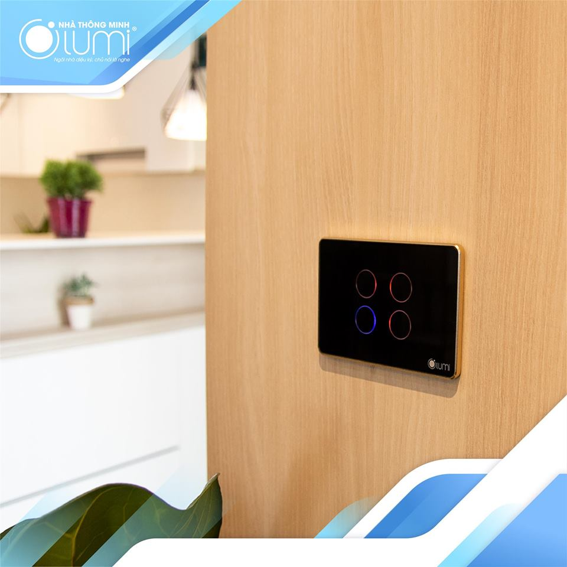

Bạn có biết rằng giọng nói hay Smartphone, tablet hoàn toàn điều khiển đèn chiếu sáng rèm cửa, điều hòa, bình nóng lạnh...

Ứng dụng công nghệ Zigbee, loT, công tắc điện Lumi giúp các thiết bị điện trong ngôi nhà kết nối với nhau và người dùng có thể điều khiển giọng nói smartphone, tablet dễ dàng, việc bật/tắt bằng tay cũng trở nên nhanh nhạy hơn với công nghệ cảm ứng điện dung đa điểm rất an toàn cho người dùng kể cả khi sử dụng tay ướt.

 Lumi mang đến cho ngôi nhà Tiện Nghi - Đẳng Cấp với công nghệ thông minh, sản phẩm chuẩn châu Âu đang là xu thế của tương lai.
 
 
 
Đã 25.000 ngôi nhà và hàng nghìn dự án đã sử dụng. Lumi tự hào là đơn vị nhà thông minh Việt có lượng người dung nhiều nhất hiện nay.

Hãy là người tiên phong sống chuẩn hiện đại

_CĂN HỘ HOÀNG GIA THÔNG MINH LUMI ĐI ĐẦU TRONG LỐI SỐNG HIỆN ĐẠI_

Lumi được lắp đặt cho căn hộ Kingston, quận Phú Nhuận, tp. HCM. Đây là căn hộ thông minh mang phong cách Hoàng Gia mà gia chủ yêu thích.

Đẳng cấp khi bạn điều khiển các thiết bị trong nhà bằng smartphone một cách dễ dàng

Sang trọng với hệ thống công tắc mặt kính cường lực hiện đại, tinh tế, chuẩn châu Âu. Viền nhôm nguyên khối mạ vàng 14k, màu sắc lôi cuốn, đang là xu hướng nội thất hiện đại.

Tận hưởng không gian sống trong lành vói nhiệt độ, độ ẩm, ánh sáng luôn đươc kiểm soát, sinh động hơn khi ánh sáng ngôi nhà luôn được biến đổi 16 triệu màu theo sở thích của chủ nhà.

Lumi là đơn vị nhà thông minh Việt duy nhất có sản phẩm đạt chuẩn CE.

Hơn 25.000 công trình và hàng nghìn dự án đã lắp đặt.

Hãy liên hệ với Gia Hân để sở hữu giải pháp nhà thông minh Lumi và tận hưởng trọn vẹn cuộc sống tiện nghi đẳng cấp ngay hôm nay.

Địa chỉ: Số 304 Nguyễn Đình Tựu, Q.Thanh Khê, TP. Đà Nẵng

Hotline: 0968.333.268 - 0935.333.268

Email: [GiahanGroup2018@gmail.com](mailto:GiahanGroup2018@gmail.com)
