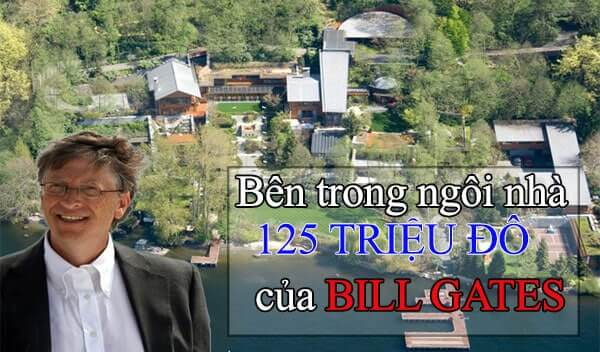
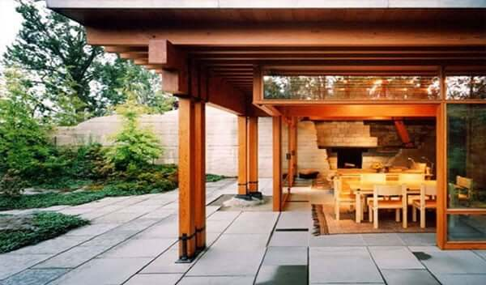
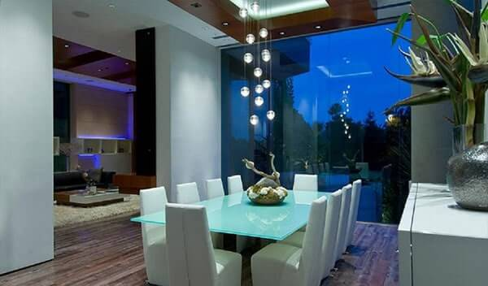
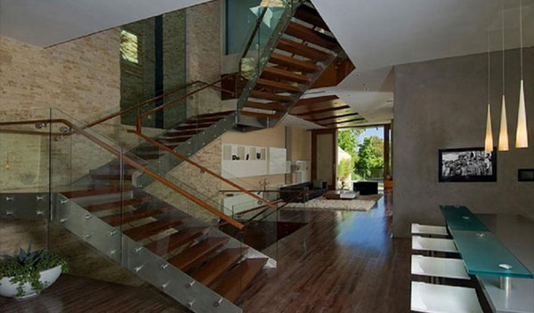
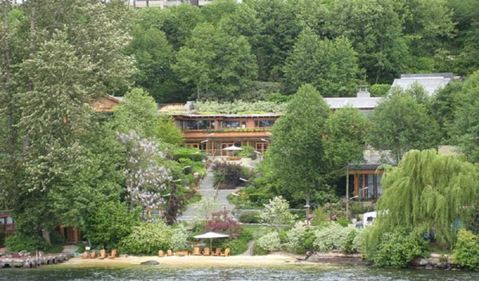

**Nói đến Bill gates không ai là không biết . Đồng sáng lập và chủ nhân Hãng máy tính Microsoft, …**

Vậy ngồi nhà điện tử của Bill gates được hình thành như thế nào và giá trị sử dụng của nó ra sao thì bài biết này sẽ trả lời tất cả.

**Quá trình hình thành ra đời của ngôi nhà**

Ngôi nhà của Tỷ phú Bill Gates ở trên một khu đất có diện tích 40.000 Fut vuông( Đơn vị đo lường Anh. 1 Fut= 30,5 Cm) rộng rãi và có cảnh quan tự nhiên rất đẹp.

Mặt tiền của ngôi nhà trông ra hồ Washington. Công việc xây dựng ngôi nhà được bắt đầu vào năm 1994 ngay sau khi Bill Gates cưới cô vợ Melinda French xinh đẹp.

Vợ ông vốn là một nữ nhân viên trong cùng Công ty của ông từ lâu. Thế nhưng, ông chỉ quen Melinda lần đầu tiên khi hai người cùng dự một buổi họp báo giới thiệu sản phẩm của Hãng Microsoft ở New York năm 1987.

Bảy năm sau, cô Melinda xinh đẹp đã đồng ý làm vợ Sếp của mình. Đến nay, họ đã có với nhau 3 mặt con. Hiện tại, Melinda không còn làm trong Hãng Microsoft nữa. Bà chuyên làm công việc từ thiện.

Lúc mới chuyển đến nhà mới. Bill Gates cũng chưa mua sắm, trang bị gì nhiều vì còn mải đầu tư vào công việc kinh doanh. Về sau, ông mới mua sắm và lắp đặt những phương tiện và đồ dùng nổi tiếng, đắt tiền như ngày nay.

Ngôi nhà thông minh được hoàn thành đầu tiên vào năm 1992 với khu phòng khách rộng 170 m2
Kể từ năm 1996 đến bây giờ, Tạp chí Forbes luôn xếp nhà Tỷ phú này đứng đầu danh sách những người giàu nhất Thế giới. Năm ngoái, tài sản của Bill Gates ước tính 46,5 tỷ USD.

Vào thời điểm năm 1997, ngôi nhà của ông có giá 53 triệu USD, đất có giá 9 triệu USD. Đến nay, ngôi nhà của tỷ phú Bill Gates được định giá lên đến 125 triệu USD.

**Sự khác biệt**

Các Kiến trúc sư cho biết: Khu nhà của Bill Gates được xây dựng theo kiểu” Biệt thự Thái Bình Dương”. Thoạt trông bề ngoài không thấy có gì nổi bật hoặc khác thường so với những biệt thự cùng loại.

Nhưng, đó chỉ là bề ngoài mà thôi. Giá trị đích thực làm cho khu nhà của Bill Gates trở nên nổi tiếng và được mệnh danh là ” Ngôi nhà thông minh” đầu tiên trong lịch sử loài người cả về nghĩ đen và nghĩa bóng lại nằm ở hệ thống những trang, thiết bị cảm ứng thông minh tinh vi, hiện đại và rất phức tạp được bố trí ở nội thất bên trong.

” Ngôi nhà thông minh” bao gồm 3 khu nhà tạo thành một quần thể, liên kết với nhau: Khu thứ nhất được ưu tiên chủ yếu giành cho việc giải trí, tiêu khiển của khách .

Những chiếc màn hình cảm ứng có giá lên đến hơn 80.000 USD được bố trí xung quanh các căn phòng.

Phòng khách có mặt tiền hướng ra hồ Washington. Trong phòng khách có một màn ảnh truyền hình phẳng, rất rộng chiếm suốt cả chiều dài bức tường chính.

Tại đây, trước khi đi vào khu chính, khách đến thăm sẽ được phát một cái “Kim găm điện tử”. Trong kim, các sở thích của mỗi khách như : Thích xem phim, ngắm tranh, nghe nhạc hoặc xem truyền hình… sẽ được mã số hóa.

Hệ thống loa thông minh được lắp dưới lớp giấy dán tường và âm nhạc luôn bám theo khách từ phòng này sang phòng khác.
Thân nhiệt của từng khách cũng được hệ thống “Nhận biết” tự động ghi lại và nhớ khi khách bắt đầu những bước đi đầu tiên thăm khu nhà.

Một Chip nhỏ tự động gửi những tín hiệu đặc biệt cho biết khách đang ở phòng nào, nhà số mấy để nhiệt độ và các dịch vụ trong những phòng đó thay đổi và phục vụ cho phù hợp với thị hiếu, nhu cầu của khách.

Theo lời kể của những khách đã đến thăm ” Ngôi nhà thông minh ” của Bill Gates thì trong thời gian ở đấy, họ cảm thấy mình đã được” phục vụ một cách vô hình ” rất tận tình bởi chẳng trông thấy… nhân viên phục vụ nào

10 năm đã trôi qua kể từ ngày xây dựng và đưa vào sử dụng cho đến nay, ngôi nhà này vẫn làm cho các khách đến thăm phải sửng sốt và khâm phục thật sự vì “sự thông minh ” của nó.

Khu trung tâm là Nhà-Thư viện. Cạnh thư viện là cầu nhảy. Bill Gates rất thích tập nhảy ở đây. Ông cho rằng cũng giống như ngồi trên ghế bành đung đưa, nhảy cầu tạo khả năng tích tụ tư duy.

Cả nhà Bill Gates sống ở khu thứ 3. Tại đây bố trí những trang, thiết bị điện tử đặc biệt hiện đại, tinh vi và phức tạp : Tự động thay đổi màu sắc trên tường, thay đổi cường độ chiếu sáng phụ thuộc vào trạng thái tâm lý, sức khỏe của chủ nhân.

Trong khu nhà còn có sân quần vợt, bể bơi nối liền với nhà tắm hơi kiểu Nhật Bản. Cách đấy không xa là một cái hồ nhỏ. Các Chuyên gia xây dựng bật mí thêm : Lúc mới bắt đầu xây nhà, Bill Gates nhất nhất yêu cầu các Kiến trúc sư và Kỹ sư xây dựng phải tuyệt đối tuân thủ bản vẽ thiết kế.

Ngôi biệt thự thông minh Xanadu 2.0 nằm trên trên sườn đồi bao quanh bởi những hàng cây cao vút. Được xây dựng trên diện tích 6.000 mét vuông, biệt thự Xanadu 2.0 được phủ xanh với rất nhiều cây cỏ.

**Cảm nhận**

Đó là ngồi nhà của tỷ phú người giàu nhất thế giới còn với người Việt thì có lẽ sản phẩm đó quá xa vời, Nhưng hiện tại Việt nam đã có đã phát triển được nhà thông minh với tên gọi LUMI đều mang tới những gì tinh tế nhất hợp với túi tiền của Người Việt các tính năng công năng đều đáp ứng được tất cả.