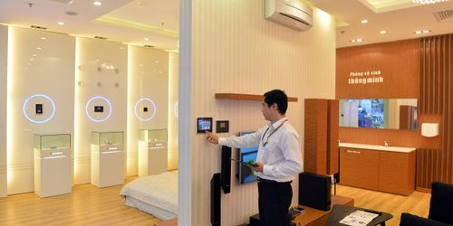

Hệ thống nhà thông minh Lumi tôi nghĩ phải đắt lắm, nhưng không, lắp nhà thông minh vô cùng hợp lý, tôi nghĩ đây là giải pháp thông minh mà bất cứ ai, đặc biệt là những người yêu thích công nghệ nên sở hữu.

Tiết kiệm thời gian và tiền của với tính năng điều khiển bằng Smartphone, người dùng không cần phải di chuyển nhiều trong nhà để bật/tắt thiết bị vì vậy sẽ có nhiều thời gian hơn để nghỉ ngơi sau ngày làm việc mệt mỏi. Tính năng này rất phù hợp với những gia đình có không gian rộng và tính chất công việc thường xuyên phải đi công tác xa nhà.
Thiết bị chất lượng cao, sản xuất tại Việt Nam nên việc đặt mua hàng và đặt hàng rất thuận tiền không mất phí vận chuyển, chi phí nên giá thành rất hợp với mọi người dân khi có nhu cầu.

Các thiết bị điện thông minh Lumi được sản xuất theo công nghệ IoT tại Việt Nam. Tất cả linh kiện điện tử cấu thành nên sản phẩm đều được nhập khẩu từ các hãng bán dẫn hàng đầu Thế giới như Texas Instrument, Freescale, NKP, Panasonic,..

Thay vì canh cánh nỗi lo về chập cháy điện hay trộm đột nhập mỗi khi đi công tác xa thì giờ đây chỉ cần lắp các thiết bị điện thông minh bạn có thể hoàn toàn an tâm. Mỗi năm Lumi Việt Nam lắp đặt hàng nghìn dự án lớn nhỏ trên cả nước, điển hình nhất phải kể đến như: Vinhome Thăng Long, Vinhomes Riverside, Vinhomes Central Park, Khu đô thị Ciputra, TNR Goldmark City,.

Đảm bảo an toàn cho cả gia đình mỗi sản phẩm của Lumi Smarthome đều được tích hợp tính năng tự động ngắt khi có sự cố về điện tránh tình trạng cháy nổ gây nguy hiểm. Hơn nữa chất liệu mà Lumi Việt Nam sử dụng đều là nhựa cao cấp, kính cường lực cách điện, cách nhiệt đảm bảo an toàn tuyệt đối cho cả gia đình đặc biệt là người già và trẻ nhỏ.

Sang trọng, đẳng cấp ngoài tập trung vào chất lượng, Lumi Việt Nam còn chăm chút đến kiểu dáng thiết kế của sản phẩm. Hầu hết các thiết bị đều có bề ngoài vô cùng sang trọng, tinh tế gồm 2 màu chủ đạo Đen và Trắng với kiểu dáng bo viền Nhôm và Vàng phù hợp với mọi không gian từ hiện đại đến cổ điển.

Chi phí lắp đặt thấp nhà thông minh ở Việt Nam luôn có chi phí rẻ hơn hẳn so với các nhà thông minh được lắp đặt bởi các hãng khác.So với các hãng nước ngoài và sản xuất tại Việt Nam, Nhà thông minh Lumi có chi phí thấp hơn hẳn. Chỉ từ 10 triệu đồng là người dùng có thể biến ngôi nhà của mình trở thành ngôi nhà thông minh với vô vàng tiện nghi.

Hãy liên hệ với Gia Hân để sở hữu giải pháp nhà thông minh Lumi và tận hưởng trọn vẹn cuộc sống tiện nghi đẳng cấp ngay hôm nay.

Địa chỉ: Số 304 Nguyễn Đình Tựu, Q.Thanh Khê, TP. Đà Nẵng

Hotline: 0968.333.268 - 0935.333.268

Email: [GiahanGroup2018@gmail.com](mailto:GiahanGroup2018@gmail.com)