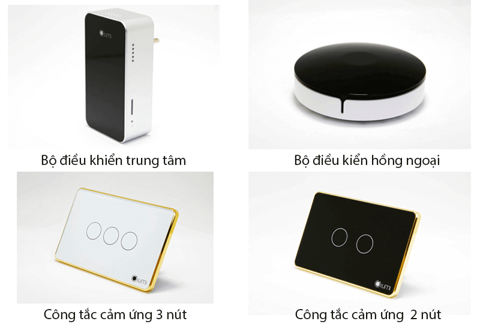
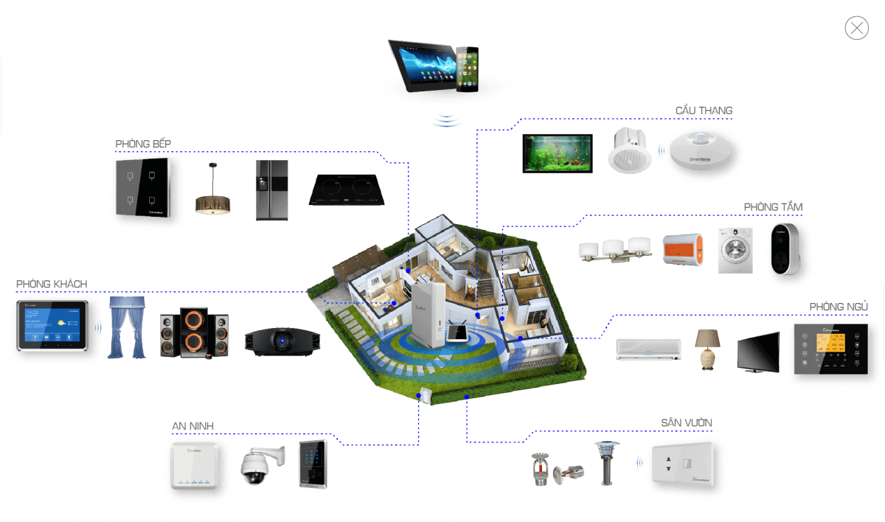
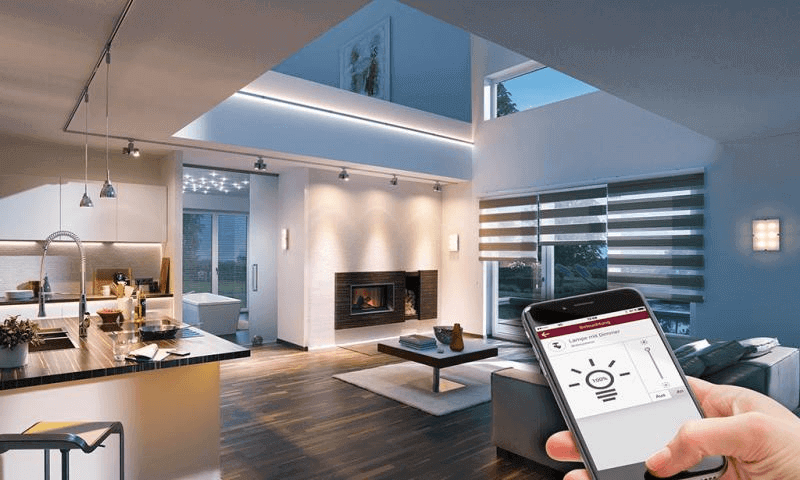

## NHỮNG CÂU HỎI THƯỜNG GẶP KHI LẮP ĐẶT THIẾT BỊ ĐIỆN THÔNG MINH

Với xu hướng tự động hóa trong thiết kế nhà ở hiện nay, việc lắp đặt các thiết bị điện thông minh ngày càng trở nên phổ biến. Hiểu được điều đó, giải pháp nhà thông minh Lumi đã ứng dụng những thiết bị điện tân tiến nhất vào giải pháp nhà thông minh của mình. Sau đây là những câu hỏi thường gặp khi lắp đặt thiết bị điện thông minh.

### 4 câu hỏi thường gặp khi lắp đặt thiết bị điện thông minh

#### Quá trình lắp đặt mất bao lâu?

Quá trình lắp đặt thiết bị điện thông minh rất nhanh chóng. Thông thường chỉ mất 1-3 ngày tùy theo số lượng thiết bị bạn muốn lắp đặt. Tất cả các thiết bị đều được sử dụng và kết nối với nhau qua công nghệ truyền thông không dây nên quá trình này không mất nhiều thời gian như bạn tưởng. Đặc biệt với đội ngũ nhân viên chuyên nghiệp nhiều năm kinh nghiệm thi công sẽ giúp bạn tiết kiệm tối đa thời gian lắp đặt.

#### Quá trình lắp đặt nhà thông minh có ảnh hưởng đến hệ thống điện trong nhà?

Câu trả lời là không. Dù ngôi nhà của bạn đã xây dựng từ lâu hay chỉ vừa mới hoàn thành và đưa vào sử dụng thì việc lắp đặt thiết bị điện thông minh cũng không gây ảnh hưởng gì đến cấu trúc sẵn có của ngôi nhà. Bởi các thiết bị điện thông minh đều được kết nối với nhau qua công nghệ truyền thông không dây. Bạn hoàn toàn có thể sử dụng hệ thống dây điện cũ để lắp đặt mà không cần phải đục từng hay đi lại đường dây điện mới.

_Quy trình lắp đặt thiết bị điện thông minh diễn ra nhanh chóng_

#### Nhà thông minh có dễ sử dụng không?

Việc sử dụng nhà thông minh rất đơn giản và an toàn với người dùng, bao gồm cả người già và trẻ nhỏ. Bạn có thể sử dụng dễ dàng thông qua các kênh điều khiển như smartphone, ipad hay điều khiển giọng nói.

_Sử dụng và kiểm soát nhà thông minh dễ dàng ngay trên điện thoại_

#### Giá nhà thông minh là bao nhiêu?

Khi nhắc đến nhà thông minh, thiết bị điện cảm ứng, công nghệ cao...người ta thường nghĩ ngay đến chi phí thiết kế và thi công tốn kém. Thực tế, để sở hữu nhà thông minh, bạn chỉ cần bỏ ra khoảng 20-30  triệu đồng.

**Với khoản chi phí trung bình nhưng bạn sẽ hưởng nhiều lợi ích mà hệ thống này mang lại như:**

* Độ bền bỉ cao, chống lại được những tác động vật lý từ môi trường, khí hậu hay các tác nhân khác.
* Lượng điện năng được tái sử dụng một cách hợp lý, giảm tiêu hao chi phí điện năng trong quá trình sử dụng, tiết kiệm chi phí tiền điện hàng tháng.
* Đảm bảo được chất lượng cũng như tuổi thọ hoạt động của các thiết bị điện.
* Tạo một môi trường thân thiện, cuộc sống tiện nghi, hiện đại.

**Giahangroup - địa chỉ cung cấp và lắp đặt thiết bị điện thông minh uy tín**

**Là một trong những nhà cung cấp thiết bị điện thông minh chính tại Đà Nẵng, Gia Hân cung cấp đầy đủ và đa dạng các thiết bị điện thông minh cũng như thi công lắp đặt. Chúng tôi phục vụ mọi nhu cầu thi công lắp đặt của quý khách từ:**

* Thay thế toàn bộ công tắc cơ thành công tắc cảm ứng Lumi với chức năng cơ bản như: Điều khiển hệ thống đèn chiếu sáng, điều khiển bật tắt bình nóng lạnh, tivi, điều hòa từ xa.
* Lắp đặt thêm hệ thống rèm cửa, hệ thống cảm biến cửa, cảm biến hồng ngoại bật tắt đèn cầu thang, nhà vệ sinh.
* Trọn bộ các giải pháp nhà thông minh Lumi gồm 8 giải pháp tại đây: Giải pháp nhà thông minh.
* Là đơn vị cung cấp và kinh doanh thiết bị điện thông minh Lumi hàng đầu Việt Nam, chúng tôi sẽ làm hài lòng khách hàng với những giải pháp tối ưu.

Trên đây là giải đáp cơ bản xung quanh vấn đề lắp đặt thiết bị điện thông minh. Nếu còn bất kỳ thắc mắc nào, hãy liên hệ ngay với chúng tôi để được hỗ trợ tư vấn một cách tốt nhất.

