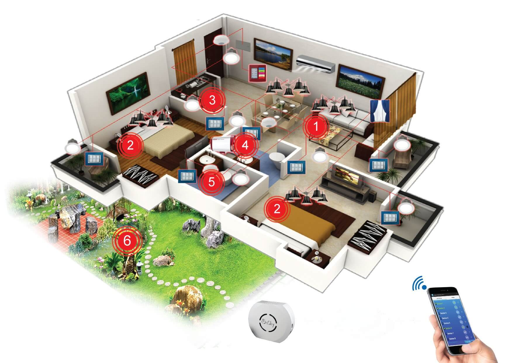

**Những lầm tưởng của người sử dụng tuy rất đơn giản nhưng rất khó để vượt qua của giải pháp nhà thông minh**

Nhà thông minh – smarthome là một ngôi nhà được sử dụng các thiết bị điện thông minh có thể điều khiển được toàn bộ các hoạt động của ngôi nhà về ánh sáng, nhiệt độ, hệ thống rèm cửa, hệ thống an ninh chống đột nhập... điều khiển mọi thiết bị điện trong nhà theo ý muốn của mình mọi lúc và mọi nơi thông qua các ứng dụng được cài đặt trên điện thoại thông minh hoặc máy tính bảng. Nhà thông minh trong tương lai còn trở nên thân thiện với con người hơn rất nhiều bởi những tính năng liên quan tới việc bảo vệ sức khỏe con người và giữ gìn môi trường sống trong ngôi nhà

Theo xu thế đáng lẽ nhà thông minh sẽ phải phát triển mạnh cùng với sự phát triển của khoa học kỹ thuật công nghệ. Nhưng hiện nay không chỉ riêng ở Việt Nam mà trên toàn thế giới, ngay cả ở các nước có trình độ kỹ thuật hiện đại thì thị trường smarthome cũng không thực sự phát triển. Hầu như chúng ta chỉ có thể thấy hệ thống Smarthome ở khách sạn 5 sao, các căn biệt thự của giới nhà giàu hoặc tại các khu resort cao cấp nên dẫn tới một lối suy nghĩ rằng Smarthome – nhà thông minh là sản phẩm chỉ dành cho giới thượng lưu. Có nhiều nguyên nhân khiến smarthome chưa thể phổ biến nhưng chủ yếu do những nguyên nhân sau:

## 1. Thay đổi tư duy, cách suy nghĩ, thói quen từ điện cơ qua điện thông minh

Từ khi nhân loại phát minh ra điện và đưa điện trở thành ứng dụng sinh hoạt vào mỗi gia đình thì thời gian cũng xấp xỉ 150 năm và ở Việt Nam cũng vào 1 thế kỷ. Trong suốt quãng thời gian rất dài đó cho đến hiện tại việc điều khiển thiết bị điện như đèn điện, máy móc vẫn đơn giản dựa vào công tắc theo kiểu On/Off bất chấp nhân loại đã đi rất xa trên con đường kỹ thuật công nghệ.

Dù việc điều khiển cơ học các thiết bị điện tồn tại rất nhiều nhược điểm, với nhiều nguy cơ lớn về tai nạn điện, cháy nổ, tiêu tốn điện năng ngoài ý muốn. Nhưng do thói quen sử dụng các thiết bị điện thông thường tư lâu đã trở thành rào cản tâm lý quá lớn khiến nhiều người có suy nghĩ sử dụng thiết bị điện Smarthome là không cần thiết, mặc dù có thừa khả năng về tài chính. Và cuối cùng, người dùng có thể sẽ lo lắng liệu hệ thống đầu tư tốn kém của mình chưa dùng được bao lâu đã lỗi thời, thậm chí phải vứt bỏ sau một thời gian ngắn.

## 2. Lo ngại về thi công lắp đặt ,sử dụng thiết bị

Sở dĩ hệ thống điện truyền thống khó bị thay thế là vì cách điều khiển rất đơn giản là bật/tắt. Nhưng khi nhắc đến Smarthome, hầu như mọi người đều nghĩ đến ngay sự phức tạp khi điều khiển vì liên quan đến công nghệ cao. Có một thực tế là cả thế giới ưa thích chiếc remote chuyển kênh ti-vi vì sự đơn giản và tiện lợi nó mang lại. Nhưng không phải vì thế mà tất cả đều ưa chuộng công nghệ nhà thông minh. Những công nghệ như nhà thông minh dường như là “ác mộng” với những ai không thạo máy tính.

Hoặc khi muốn lắp đặt, thì khách hàng thường nghĩ đến việc phải phá vỡ cấu trúc công trình của ngôi nhà để lắp đặt các thiết bị, hệ thống điện. Những lo ngại của khách hàng hoàn toàn có cơ sở, song ngày nay không phải với tất cả thiết bị nào cũng phải phá, đục tường để lắp đặt.

**Giá cả chính là rào cản lớn nhất đối với thiết bị nhà thông minh**

Nguyên nhân chính đó chính là giá thành của các thiết bị điện cho nhà thông minh. Hầu hết, các sản phẩm thiết bị thông minh của các hãng công nghệ đều có giá thành khá cao so với các sản phẩm thông thường. Để lắp đặt đồng bộ hoàn chỉnh một hệ thống điện nhà thông minh, thì chi phí, giá thành thiết bị cả các sản phẩm ngoại là rất đắt đỏ.

Hiện nay, tại thị trường nhà thông minh ở Việt Nam có khá nhiều công ty đã làm chủ được công nghệ nhà thông minh. Một trong số đó là công ty Cổ phần Lumi Việt Nam đã tạo nên một cuộc “cách mạng” về giá cả khi đưa ra một bộ giải pháp nhà thông minh có giá thành chỉ bằng 1/3 so với các sản phẩm ngoại, dao động từ 30-90 triệu đồng tùy theo gói lắp đặt, từ căn hộ chung cư, nhà phố cho đến biệt thự sân vườn. 

Đại diện của Lumi Việt Nam cho biết: “Lâu nay, thị phần nhà thông minh tại Việt Nam hầu hết thuộc về các thương hiệu nước ngoài nên khách hàng thường e ngại vì chi phí quá lớn. Để giải quyết vấn đề đó và tạo thuận lợi cho khách hàng lựa chọn, Lumi Việt Nam mang đến 3 gói giải pháp nhà thông minh. Gói cơ bản chỉ đơn thuần là việc thay đổi phong cách sống thông qua hệ thống công tắc chạm cảm ứng hiện đại. Gói tiện ích sẽ tích hợp tất cả các thiết bị điện bằng điều khiển từ xa. Và đặc biệt gói nhà thông minh sẽ giúp bạn kiểm soát và điều khiển các thiết bị điện trong nhà dù ở bất kỳ nơi đâu, ở cơ quan hay đang đi du lịch, công tác…”