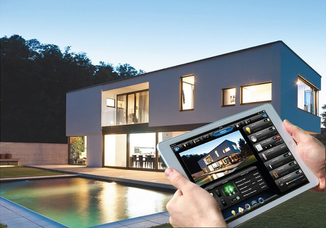
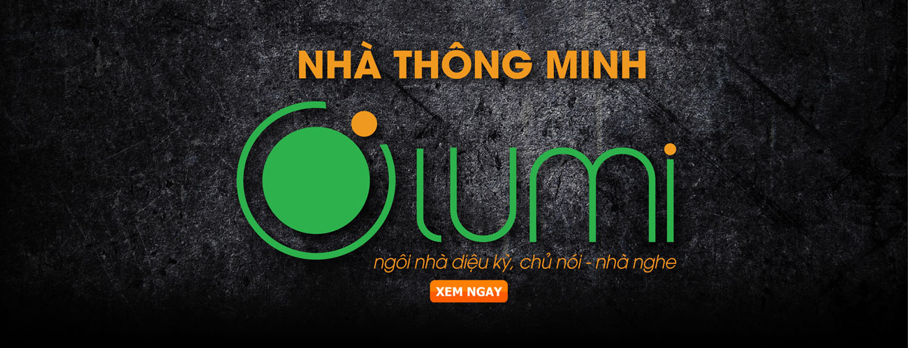

**Theo  chuyên gia đầu nghành về sản phẩm  điện thông minh nhận định, sự phát triển mạnh mẽ của cuộc cách mạng công nghiệp 4.0 với các công nghệ mới như IoT, Trí tuệ nhân tạo thì nhà sản xuất LUMI… đã và sẽ tạo động lực để việc ứng dụng các giải pháp nhà thông minh ngày càng trở nên phổ biến hơn tại Việt Nam.**

**Miền đất hứa hẹn nhiều thay đổi**

Nhũng kĩ sư đã có gần 20 năm hoạt động trong lĩnh vực CNTT nhận định, cung cấp giải pháp nhà thông minh đang là thị trường đầy tiềm năng và mầu mỡ, phù hợp với các công ty phần mềm, phần cứng và điều khiển (IoT). Theo nhận định của vị chuyên gia này, thị trường nhà thông minh tại Việt Nam vẫn mới chỉ sơ khai  , các hệ thống nhà thông minh mới chủ yếu chỉ được ứng dụng trong phân khúc cao cấp, các công trình cao tầng hiện đại.

Trong bối cảnh cuộc cách mạng công nghiệp (CMCN) 4.0 đang diễn ra mạng mẽ, tác động tới mọi ngành mọi lĩnh vực của đời sống xã hội, cuộc cách mạng này chính là động lực thúc đẩy sự phát triển của thị trường cung cấp giải pháp nhà thông minh, nhu cầu của người dùng sẽ gia tăng mạnh hơn trong thời gian tới”.

Đồng thuận với quan điểm cho rằng làn sóng CMCN 4.0 với sự phát triển mạnh của các công nghệ mới như IoT-Internet kết nối vạn vật, AI -Trí tuệ nhân tạo, Robotics… tạo động lực để thúc đẩy các giải pháp nhà thông minh được sử dụng nhiều hơn, tuy nhiên từ góc độ của doanh nghiệp đã tham gia thị trường từ hơn 10 năm trước, Bkav cho rằng xu hướng nhà thông minh đang dần trở nên phổ biến tại Việt Nam.

“Thời gian 2 năm gần đây, khi cuộc CMCN 4.0 được nhắc đến nhiều hơn, nhà thông minh được mọi người, nhất là những người trẻ quan tâm hơn.Tôi cho rằng, cuộc cách mạng này là một yếu tố khiến cho nhà thông minh trở nên phổ biến sẽ càng phổ biến hơn trong thời gian tới

Lấy chính hoạt động của doanh nghiệp để minh chứng, , trong 2 năm 2016 - 2017, số lượng khách hàng sử dụng giải pháp nhà thông minh LUMI phát triển tăng trưởng cao. Liên tiếp trong khoảng từ cuối năm 2016 và trong năm 2017 vừa qua,LUMI đã nhận được nhiều dự án lớn như: 2 dự án Shophous  Đà Nẵng thời gian tới Lumi sẽ triển khai lắp đặt toàn hệ thống cho dự án MaLiBu Hội An với mô hình Condetel.

Ngoài tác động của CMCN 4.0 ở góc độ khiến cho nhiều người Việt biết đến những tiện ích, công năng, giá trị thực sự của các hệ thống tự động hóa, sự phổ biến của các giải pháp nhà thông minh thời gian gần đây theo đại diện LUMI còn bởi các chi phí sản xuất thiết bị cho nhà thông minh đã giảm nhiều so với giai đoạn trước.

“Cách đây vài năm, nói đến nhà thông minh, mọi người thường nghĩ nó là thứ xa xỉ, khó tiếp cận. Những năm 90, Bill Gates sở hữu nhà thông minh trị giá hơn 100 triệu USD. Tuy nhiên, thực tế hiện nay, với xu hướng phát triển của CMCN 4.0, các chi phí sản xuất thiết bị cho giải pháp nhà thông minh đã giảm xuống, vì thế hệ thống nhà thông minh như Bill Gates trước đây - hiện đã được các doanh nghiệp như LUMI có thể triển khai được với mức giá thấp hơn rất nhiều và nhiều người có thể tiếp cận với nó được. Thậm chí, với LUMI, người dùng chỉ cần phải bỏ ra khoảng 30 triệu đồng đã có một hệ thống nhà thông minh tương đối cơ bản để dùng hàng ngày. Con số này chỉ chiếm khoảng 3 - 5% trong tổng chi phí xây dựng, sửa chữa một ngôi nhà tại Việt Nam hiện nay”, đại diện LUMI cho biết

Lumi Việt Nam - doanh nghiệp cũng đã có 8 năm cung cấp giải pháp nhà thông minh, những năm trở lại đây, trong xu hướng CMCN 4.0, các giải pháp công nghệ IoT phát triển mạnh mẽ, khi các công ty công nghệ Việt đã bắt tay nghiên cứu và cho ra đời giải pháp nhà thông minh “Made in Vietnam” phù hợp hơn với nhu cầu và túi tiền của người Việt, thị trường nhà thông minh tại Việt Nam đã sôi động hơn.

