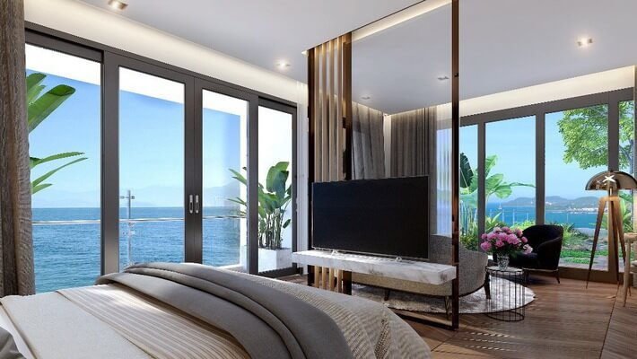

## Secondhome ngôi nhà thứ 2 của Chủ Nhân

Ngày nay việc sở hữu biệt thự nghỉ dưỡng không còn đơn thuần chỉ là thú vui xa hoa của giới thượng lưu. Ngôi nhà thứ hai – Second home - loại sản phẩm ven biển nhưng giá trị chỉ khoảng trên dưới 1 tỷ đồng đã trở thành xu hướng của giới trẻ thành đạt Sở hữu căn nhà thứ 2 trở thành xu hướng chung của bất động sản toàn cầu. Tại Anh, có đến 600.000 hộ gia đình sở hữu Second Home. Còn ở Trung Quốc, cũng có khoảng 15% hộ gia đình sở hữu hình thức bất động sản này.

Tại Việt Nam, trước đây ngôi nhà thứ hai được “mặc định” cho tầng lớp đại gia và thường là những người lớn tuổi. Tuy nhiên, cùng với sự “nóng” lên của bất động sản nghỉ dưỡng và tâm lý xã hội, xu hướng sở hữu ngôi nhà thứ hai đang được trẻ hóa. Theo một cuộc khảo sát, đa phần giới trẻ từ độ tuổi 30 -35 có nhà tại các thành phố lớn, thu nhập từ mức khá đổ lên đều bày tỏ nguyện vọng sở hữu ngôi nhà thứ hai ven biển. Bên cạnh mục đích nghỉ dưỡng, đầu tư, “Second home” còn là nơi khẳng định đẳng cấp của giới trẻ thành đạt.

Anh Hoàng (35 tuổi, ở Thủ Đô Hà Nội chia sẻ: “Thay vì ở khách sạn chật chội, việc sở hữu ngôi nhà ven biển là cảm giác rất tuyệt vời vì ở đó, gia đình tôi có thể thoải mái nghỉ dưỡng, làm những điều mình thích.” Trong khi đó, C Trâm Anh (36 tuổi, Nha Trang ) lại hào hứng cho biết: “Tôi đang có dự tính mua một ngôi nhà tại Đà Nẵng đề gia đình và bạn bè có nơi vui chơi, nghỉ dưỡng vào dịp cuối tuần. Ngoài ra, tôi sẽ xây thêm phòng cho khách du lịch thuê lại. Trung bình một tháng, tôi có thêm thu nhập từ 10-15 triệu từ nguồn thu này”.

Tại hội nghị “Bất động sản nghỉ dưỡng 2016: Tiềm năng & Thách thức” vừa diễn ra hồi tháng 2 tại Hà Nội và TP.HCM, các chuyên gia đầu ngành về kinh tế nhận định, năm 2016 sẽ là năm bùng nổ của bất động sản nghỉ dưỡng.

Với việc căn hộ thứ 2 của đang trở nên phổ biến,thì các vật dụng trong căn nhà cũng cần được thay đổi từ các thiết bị phổ thông sang các thiết bị cao cấp hơn "Smarthome" Chính là cái còn thiếu để Secondhome trở nên đúng nghĩa hơn.

Tùy vào giải pháp xây dựng của CDT mà chúng ta đưa ra những gói giải pháp Nhà Thông Minh LUMI do GiaHan phân phối tại Đà Nẵng hay và ứng dụng thực tế nhất cho các vị khách khó tính nhất

Với ngôi nhà thông thường để điều khiển rèm cửa, điều hòa, bình nóng lạnh, quạt ... bạn phải đến tận hàng chục công tắc. Nhưng với Lumi, bạn có thể điều khiển mọi thiết bị bằng một cái chạm nhẹ  trên smartphone hay máy tính bảng dù ở bất cứ nơi đâu. Đặc biệt, với giải pháp mới điều khiển nhà thông minh bằng giọng nóit iếng Việt 3 miền: Bắc, Trung, Nam,bằng những câu thoại đơn giản, bạn có thể bật/tắt một cách dễ dàng.
Ngoài ra, bạn còn điều khiển các thiết bị theo ngữ cảnh cài đặt sẵn như: tiếp khách, xem phim, đi ngủ…một hệ thống gồm: các thiết bị điêu hòa, rèm, đèn chiếu sáng, bình nóng lạnh luôn ở chế độ sẵn sàng chào đón bạn. Bạn chỉ cần chọn chế độ mình muốn.

Đèn hành lang, cầu thang ... nhà bạn sẽ tự động bật khi có người di chuyển và ngược lạinhờ cảm biến chuyển động, giải pháp giúp bạn tiết kiệm điện năng hiệu quả.

Hệ thống loa âm thanh đa vùng, cho phép các khu vực khác nhau trong nhà cùng 1 lúc có thể phát nhiều nguồn nhạc khác nhau, và tự động phát nhạc theo lịch khung thời gian cài đặt trong ngày. Ví dụ: 6h sáng và 17h chiều,  theo đó mỗi sáng thức dậy bạn sẽ được tận hưởng ngay 1 bản nhạc du dương và 1 bài hát sôi động khi đi làm về hằng ngày.

Trước nhu cầu sở hữu "second home" ngày càng cao và người mua có xu hướng kỹ tính hơn, chủ đầu tư trong và ngoài nước đã quyết tâm đầu tư dự án căn hộ tại thị trường Đà Nẵng với những tiêu chuẩn cao cấp nhất tại thành phố đáng sống.

Giải pháp nhà thông minh đang được ứng dụng mạnh mẽ và chuỗi căn hộ SecondHome

Điều khiển vạn vật trong nhà bằng smartphone và giọng nói.... !

➡️ Nhà thông minh Lumi đạt tiêu chuẩn Châu Âu với chứng chỉ CE và UL, mang đến cho bạn không gian sống tiện nghi, đẳng cấp với giá chỉ từ 30 Triệu

Hãy liên hệ với Gia Hân để sở hữu giải pháp nhà thông minh Lumi và tận hưởng trọn vẹn cuộc sống tiện nghi đẳng cấp ngay hôm nay.

Địa chỉ: Số 304 Nguyễn Đình Tựu, Q.Thanh Khê, TP. Đà Nẵng

Hotline: 0968.333.268 - 0935.333.268

Email: [GiahanGroup2018@gmail.com](mailto:GiahanGroup2018@gmail.com)
