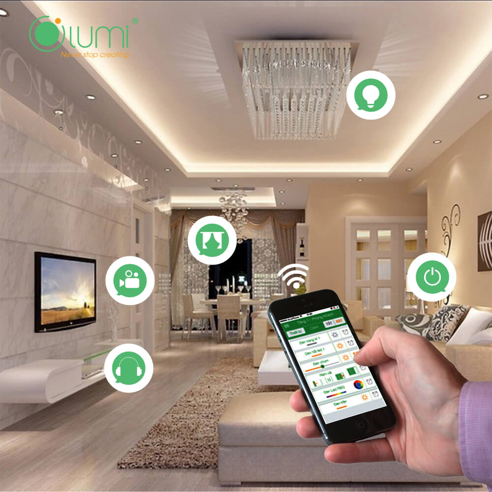

**Nhà thông minh đã trở thành một khái niệm lạ mà quen trong thiết kế. Để xây dựng một căn nhà thông minh đúng nghĩa mà tiết kiệm chi phí nhất, chúng ta cần phải lưu ý những gì?**

## Thiết kế kiến trúc khi xây nhà thông minh

Nhà thông minh cũng như một ngôi nhà bình thường, trước khi xây dựng cần có bản vẽ kiến trúc của căn nhà. 

Tuy nhiên cách hoạt động của nhà thông minh khác căn nhà thường. Công năng sử dụng khác nhau nên phải thiết kế sao cho phù hợp với nhu cầu sử dụng của bạn.

## Nội thất thông minh

Việc sử dụng nội thất thông minh giúp căn nhà bạn đa dạng hơn về công năng, sử dụng được nhiều kịch bản khác nhau.

Hãy sắp xếp bố trí phù hợp các nội thất trong nhà để sử dụng diện tích tối ưu nhất.

## Diện tích ngôi nhà

Tùy theo diện tích ngôi nhà bạn lớn hay nhỏ, khoảng cách các phòng cách xa hay không để có thể đưa ra phương án lắp đặt thiết bị thông minh phù hợp.

Nếu diện tích nhà bạn không quá lớn thì nên dùng giải pháp lắp đặt thiết bị thông minh không dây, chúng kết nối với nhau qua wifi giúp bạn tiết kiệm chi phí hơn.

Đồng thời các thiết bị không dây này cũng dễ dàng thay đổi khi có hư hỏng. Nhược điểm của các thiết bị này cần hệ thống wifi mạnh, các thiết bị nên gần modem wifi để có thể hoạt động tốt nhất.

Cần biết rõ diện tích nhà bạn bao nhiêu để chọn giải pháp nhà thông minh phù hợp

Đối với các nhà có diện tích lớn nên lắp đặt hệ thống thiết bị có dây là tối ưu nhất, hệ thống này hoạt động thông qua bộ điều khiển trung tâm.

## Vị trí đặt các thiết bị thông minh trong nhà
 
Trong bản vẽ thiết kế nhà có 1 bản vẽ thể hiện sơ đồ bố trí các thiết bị điện. 

Lắp đặt thiết bị thông minh sao cho hài hòa và tiện lợi khi sử dụng.Lựa chọn nhà cung cấp thiết bị cho nhà thông minh uy tín, chất lượng.

Khi xây nhà thông minh mới đương nhiên chủ nhà rất muốn mọi thứ suôn sẻ. Tuy nhiên không thể quan sát và nắm bắt tình hình xây dựng hết được.

Đối với nhà thông minh thì thiết bị thông minh lắp đặt trong nhà là quan trọng nhất. Bạn nên tìm các công ty chuyên về giải pháp nhà thông minh để họ tư vấn và lắp đặt theo ý muốn của bạn.

Đừng nên sử dụng các thiết bị không rõ nguồn gốc, rất không an toàn.

## Hệ thống quản lý nhà tự động

Ngoài những lưu ý trên bạn cần phải biết rằng tất cả các hoạt động của ngôi nhà sẽ được giám sát dưới một hệ thống lập trình tổng. Tức là với bất kỳ hoạt động nào hệ thống sẽ thông báo cho người sử dụng dưới dạng các báo cáo tin nhắn hoặc cảnh báo bằng giọng nói nếu có thấy nguy hiểm. Tất cả sẽ được gửi vào thiết bị cầm tay như điện thoại thông minh hoặc máy tính bảng, khi đó việc quản lý ngôi nhà sẽ trở nên vô cùng đơn giản và tiện lợi.

**Các yếu tố khác**

Ngôi nhà thông minh là ngôi nhà có hệ thống điện hoàn hảo, các thiết bị điện được lập trình một cách tối ưu hóa cho việc điều khiển và vận hành. Để thiết kế nhà thông minh đúng nghĩa cần chú ý tới các yếu tố sau:

## Nhà thông minh thân thiện với môi trường:

 không phải là yếu tố quan trọng nhất trong một hệ thống nhà thông minh, nhưng nó cũng là yếu tố góp phần cho nhà thông minh trở nên hoàn hảo hơn. Một ngôi nhà thông minh thì bên trong nó không thể thiếu được một hệ sinh thái bởi nó sẽ tạo được sự cân bằng về mặt môi trường cũng như thẩm mỹ. Và hệ sinh thái trong nhà thông minh sẽ làm cho cuộc sống của bạn được trở nên cân bằng hơn với hệ thống điều hòa môi trường, kiểm soát các thông số môi trường như nhiệt độ, độ ẩm…
 
## Tiết kiệm năng lượng:

 là vấn đề không thể thiếu được khi nhắc đến nhà thông minh. Và điều đó được thể hiện ở việc là các thiết bị có thể được khai thác và sử dụng tốt nhất nguồn nguyên liệu có sẵn trong thiên nhiên, ví dụ như: sức gió, năng lượng mặt trời, … thay cho việc tiêu tốn nhiên liệu sử dụng cho các thiết bị công nghệ hiện đại.

## Hệ thống điện thông minh:

Có thể nói đây là yếu tố quan trọng nhất quyết định đến đó có phải là một ngôi nhà thông minh hay không. Hệ thống điện thông minh trong ngôi nhà bao gồm hệ thống chiếu sáng thông minh, hệ thống rèm cửa tự động, hệ thống kiểm soát môi trường, hệ thống an ninh giám sát…

