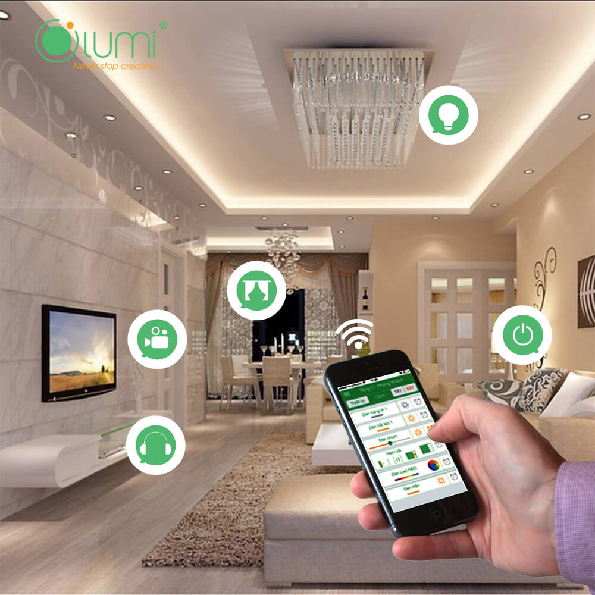
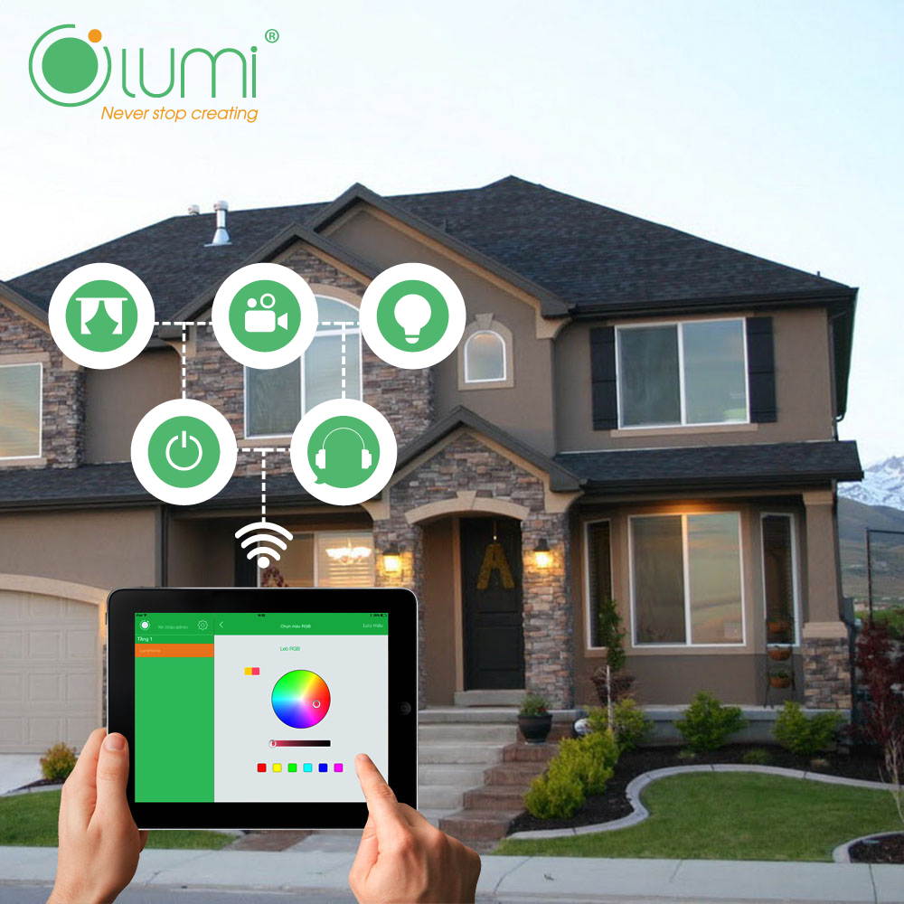

Khí hậu việt nam là khí hậu nhiệt đới nhưng khí hậu Việt Nam phân bố thành 3 vùng khí hậu riêng biệt, mưa rét trong mùa đông thường được xem là nguyên nhân chính khiến cho các thiết bị điện trong gia đình luôn ở trong trạng thái chập chờn, ẩm mốc hoặc có nguy cơ hỏng hẳn. Để khắc phục hiện tượng này, bên cạnh những lưu ý quan trọng như ưu tiên các biện pháp chống ẩm, bảo quản thiết bị điện đúng cách thì việc thay đổi và đưa vào sử dụng giải pháp nhà thông minh với những tính năng ưu việt cũng là lựa chọn đang được rất nhiều người tiêu dùng tin tưởng áp dụng.

## Những khuyến cáo khi sử dụng thiết bị điện thông minh

### Để xa các thiết bị điện khỏi khu vực ẩm ướt

Sàn nhà, phòng tắm, phòng hơi là những khu vực ẩm ướt nhất trong nhà mỗi mùa mưa rét. Vì vậy, để đảm bảo yếu tố an toàn, tránh bị nhiễm điện, người dùng cần giữ cho các thiết bị dẫn nối như ổ cắm, công tắc ở vị trí khô ráo. Lưu ý tuyệt đối không để tình trạng hơi nước bám trên bề mặt các thiết bị điện trong thời gian dài vì có thể gây ra các hiện tượng rò điện, nhiễm điện.

Sử dụng công tắc cảm ứng với mặt kính cường lực là cách để bảo vệ bạn được an toan nhất hiện nay,  cách điện này sẽ giúp chống lại các hiện tượng rò điện, nhiễm điện.

### Lựa chọn các thiết bị điện an toàn

Các thiết bị điện sử dụng phổ biến trong mùa đông có thể kể đến như điều hòa, bình nóng lạnh, hệ thống quạt sưởi, đèn sưởi... Khi chọn các thiết bị này, yếu tố an toàn luôn phải được đặt lên hàng đầu. Người tiêu dùng nên kiểm tra kỹ thông tin về sản phẩm, đảm bảo chắc chắn sản phẩm đáp ứng được đầy đủ các chỉ số an toàn như tính năng chống rò điện, khả năng tự ngắt điện trong một khoảng thời gian định sẵn hay có đèn báo sáng trong điều kiện đêm tối…

### Giải pháp cho việc sử dụng thiết bị điện an toàn trong ngày đông mưa rét hay mùa mưa kéo dài ở Việt Nam

Trong những ngày mưa rét, nhu cầu sử dụng các thiết bị làm khô, làm ấm tăng vọt, kéo theo sự tương tác giữa người dùng và các thiết bị cũng thường xuyên hơn, làm tăng nguy cơ chập cháy, nhiễm điện, nhất là trong những ngày độ ẩm lên cao, mưa rét kéo dài gây ảnh hưởng tới oan toàn của chính người dùng. Vậy giải pháp nào là giải pháp thực sự hiệu quả cho câu hỏi về nhu cầu sử dụng đẩy đủ các sản phẩm cần thiết trong mùa đông mà vẫn đảm bảo được độ an toàn tuyệt đối cho bản thân cũng như các thiết bị điện?

Bạn có thể điều khiển các thiết bị điện từ xa thông qua Smarthome hay bằng chính giọng nói của mình, giúp giảm nguy cơ nhiễm điện mùa mưa hay những ngày độ ẩm lên cao.

### Giải pháp chiếu sáng thông minh

Trên thực tế, mô hình chiếu sáng truyền thống với hệ công tắc cơ đã gây ra nhiều những trở ngại nhất định, đặc biệt là nguy cơ nhiễm điện mùa nồm ẩm. Để khắc phục những vấn đề này, giải pháp nhà thông minh của Lumi đã được ra đời với các kịch bản chiếu sáng được thiết lập sẵn, mang lại cho người sử dụng những trải nghiệm lý thú. Thay vì phải “bật - tắt” như các loại công tắc thông thường, với công tắc điện cảm ứng của Lumi, bạn chỉ cần chạm, lướt nhẹ trên bề mặt công tắc hoặc smartphone, ipad là có thể điều khiển thiết bị như ý muốn. Không chỉ vậy, vơi thiết kế tối giản, hiện đại; bề mặt kính gia cường dày 4mm, các sản phẩm công tắc thông minh của Lumi cam kết đảm bảo khả năng chống xước, chống va đập, chống nồm ẩm ưu việt… Ngoài ra, chức năng vòng tròn tỏa sáng xung quanh hệ thống công tác cảm ứng được đưa vào ứng dụng, người dùng có thể dễ dàng xác định được vị trí của hệ thống điện, không cần phải dò trong đêm tối. Đây là một bước tiến đột phá giúp tăng cường sự an toàn cho người dùng khi sử dụng các thiết bị, nhất là đối với người già và trẻ nhỏ.

### Giải pháp an toàn khi sử dụng bình nước nóng, hệ thống điều hòa nhiệt độ

Không phải lo lắng về nguy cơ rò điện hay mất an toàn khi kích hoạt hoặc sử dụng, với Lumi, bạn chỉ cần 1 click trên những chiếc Iphone hay Sam sung...những chiếc Smarthome, bình nóng lạnh sẽ bật, hệ thống quạt thông gió, đèn sưởi sẽ khởi động, sẵn sàng phục vụ. Bạn cũng có thể bật/tắt, tăng giảm đèn sưởi, điều hòa, bình nước nóng... ở bất kỳ đâu thông qua hệ thống Module cảm biến hồng ngoại đã được thiết lập.

