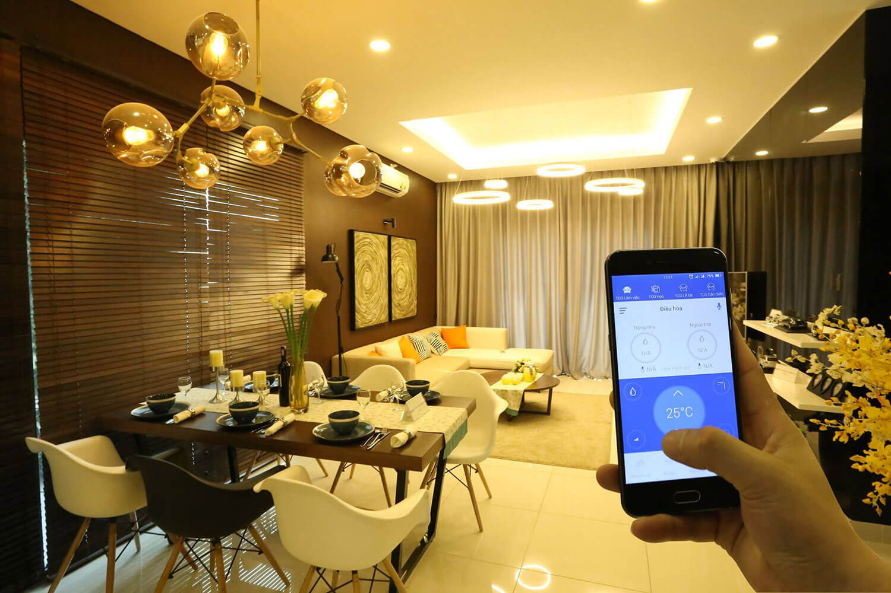

Để khẳng định rằng nhà thông minh  của nhà sản xuất LUMI chính là giải pháp hiện nay được rất nhiều người chọn lựa bởi  tiện ích, lắp đặt, thi công dễ dàng, độ bảo mật cao hiện đại cũng như độ an toàn tuyệt vời của nó. Để giúp bạn hiểu rõ hơn trước khi lắp đặt nhà thông minh bài viết dưới đây sẽ đưa ra những tiêu chí quan trọng và cần thiết khi lắp đặt cũng như sử dụng hệ thống nhà thông minh "Smarthome"

## Tiêu chí đầu tiên: Nhanh chóng chỉ với 1 chạm vạn tiện nghi.

Thông thường để điều khiển chiếu sáng trong nhà, bạn phải di chuyển và bật tắt rất nhiều công tắc cảm ứng, tuy nhiên với nhà thông minh của Lumi, các kịch bản chiếu sáng được thiết lập sẵn cho từng hoạt cảnh cụ thể, chỉ một chạm là bạn có thể điều khiển hệ thống chiếu sáng theo ý muốn. Ví dụ khi có khách đến nhà, nhấn vào chế độ “tiếp khách”  một loạt các bóng đèn sẽ cùng bật sáng lên,  hoặc khi ra ngoài, chỉ cần ấn nút “ đi vắng” toàn bộ hệ thống đèn trong nhà sẽ tắt đồng loạt.

Tiêu chí đầu tiên để chúng ta thi công và lắp đặt nhà thông minh LUMI  dành cho bạn đó chính là phải nhanh, tiện lợi chỉ với “một nút bấm”. Bởi lẽ thông thường thì để điều khiển những thiết bị trong nhà thông minh đòi hỏi bạn cần phải có nhiều công tắc. Điều này thật sự gây khó khăn trong việc sử dụng chúng đồng thời còn tốn nhiều thời gian nữa. Thế nên tiêu chí đầu tiên mà bạn cần đặt ra khi thiết kế lắp đặt nhà thông minh đó chính là chỉ cần một nút bấm điều khiển trung tâm trên màn hình của smartphone hoặc máy tính bảng là bạn có thể tắt toàn bộ đèn chiếu sáng trong nhà của mình, thật tiện lợi đúng không nào. Chắc chắn rằng, với tiêu chí này sẽ giúp bạn có được sự tiện lợi khi sử dụng đồng thời đem lại những trải nghiệm thú vị nhất.

## Tiêu chí thứ hai: Chạm nhẹ để điều khiển tất cả.

Sau tiêu chí nhanh với một nút bấm thì chạm để điều khiển cũng chính là lưu ý tiếp theo dành cho bạn khi tiến hành lắp đặt nhà thông minh, điều này đảm bảo mang lại tính tiện nghi cho bạn. Khi khách đến chỉ cần chạm tay vào nút tiếp khách thì ngay lập tức đèn ở phòng khách sẽ được bật lên và rèm cửa cũng tự động kéo lên… điều này sẽ giúp bạn tiết kiệm thời gian một cách hiệu quả. Nhất là đối với những trường hợp đi ngủ, việc tìm điều khiển để tắt rất nhiều những vị trí cần thiết trong nhà làm mất nhiều thời gian của bạn. Tuy nhiên khi đến với lắp đặt nhà thông minh thì tất cả đều được giải quyết nhanh chóng và dễ dàng nhất thông quan một nút bấm.

## Tiêu chí thứ 3 : Đẳng cấp và khác biệt

Thực sự khi thiết kế lắp đặt nhà thông minh hiện đại, yếu tố về sự tiện nghi cũng như đẳng cấp cho ngôi nhà thông minh là một tiêu chí quan trọng. Với những buổi đi làm về mệt mỏi bạn không cần phải tốn nhiều thời gian trong việc mở từng lớp cửa, bật điều hòa, bật nhạc… Mà ở đây lắp đặt nhà thông minh sẽ mang đến cho bạn sự thuận tiện nhất. Nó giúp bạn cảm thấy thoải mái hơn và dễ chịu hơn sau một ngày làm việc căng thẳng mệt mỏi. Sự khác biệt được thể hiện rõ ràng qua từng thiết bị của LUMI, khi các đơn vị thi công khác đang còn tim hướng đi thì nhà thông minh LUMI đã vươn tới sự khác biệt rõ rệt với các sản phẩm cùng loại.để rồi thay thế hẳn kiểu nhà truyền thống cơ học sang nhà thông minh vạn điều hay và đơn giản hơn rất nhiều.

## Tiêu chí thứ 4 : Điều khiển bằng giọng nói của gia chủ ( tự hào là sản phẩm mang thương hiệu VIỆT)

Việc thiết kế lắp đặt nhà thông minh hiện đại sẽ không chỉ điều khiển được trên smartphone mà còn giúp bạn điều khiển thông qua giọng nói của chính mình với sản phẩm mang đâm chất người Việt do đội ngũ LUMI nguyên cứu và phát triển dứa trên nền tảng công nghệ 4.0 . Bởi vì nhà thông minh trang bị công nghệ trợ lý ảo mang đến cho chủ nhân của nó một phong cách vô cùng đẳng cấp. Thoát khỏi ra cứng nhắc của hệ thống điều khiển thông thường, chức năng lắp đặt nhà thông minh ra lệnh bằng giọng nói giúp mang đến cùng bạn sự trải nghiệm thú vị tuyệt vời vô cùng.

Với các tiêu chí lắp đặt nhà thông minh LUMI trên, bài viết hy vọng sẽ giúp bạn hiểu rõ những đỉnh cao của công nghệ lắp đặt nhà thông minh hiện đại. Nếu bạn đang có nhu cầu trong việc lắp đặt nhà thông minh thì hãy đến với Giahangroup.vn  để được tư vấn dịch vụ này một cách nhanh chóng và tiện lợi nhất bạn nhé!

Hãy liên hệ với Gia Hân để sở hữu giải pháp nhà thông minh Lumi và tận hưởng trọn vẹn cuộc sống tiện nghi đẳng cấp ngay hôm nay.

Địa chỉ: Số 304 Nguyễn Đình Tựu, Q.Thanh Khê, TP. Đà Nẵng

Hotline: 0968.333.268 - 0935.333.268

Email: [GiahanGroup2018@gmail.com](mailto:GiahanGroup2018@gmail.com)
