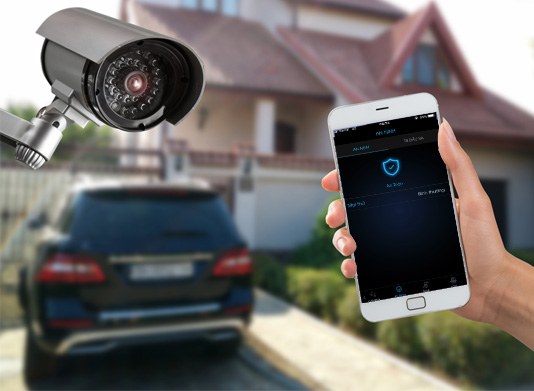

## 1. Lo ngại về an ninh bảo mật

Các loại camera giám sát hiện nay, cảm biến chuyển động hay cảm biến cửa, điều khiển khóa cửa  tự động và thiết bị dò chuyển động vẫn hay được lắp đặt ở các cơ sở kinh doanh, tòa nhà công cộng nay đã có thể lắp đặt cho nhà ở.

Tương tự như các loại thiết bị báo cháy thông minh với những cảnh báo về khói, khí CO và dò sự rò rỉ nước hứa hẹn sẽ làm giảm chi phí bảo hiểm cho rủi ro này.

“Rất nhiều nhà cung cấp đã bắt đầu từ hệ thống an ninh vì mô hình kinh doanh này đã tồn tại lâu rồi” Michael Philpott, nhà phân tích tại công ty nghiên cứu công nghệ Ovum, đã nói với BBC. Ông còn cho biết “ Ở Anh có khoảng 30% nhà ở có thiết bị cảnh báo an ninh, và chỉ 10% số này chi trả hàng tháng cho một hệ thống an ninh chuyên nghiệp”,

Một số công ty mới xuất hiện để khai thác thị trường, như là Homeboy, Arlo, Canary, Dropcam và Piper. Trong khi các công ty lâu đời như ASSA Abloy, Honeywell và cả Siemens đã giới thiệu giải pháp an ninh cho nhà thông minh của mình.còn với LUMI thì công nghệ này đã dần được tin tưởng và sủ dụng đồng bộ.

Nhưng tội phạm và khả năng của chúng cũng tăng dần tới mức có thể làm hư hại hệ thống cơ sở hạ tầng vẫn đang là một rào cản lớn.

Tự động hóa ngôi nhà thực sự đã mở ra một rủi ro về an ninh mạng mà trước đây vẫn chưa tồn tại. Chỉ bằng cách làm cho các thiết bị IoT cố gắng chống lại và đưa ra các mặc định an ninh cơ bản sẽ có thể làm dịu rủi ro này.

## 2. Khả năng tương tác, phản hồi

Lumi chỉ mới phát triển được giọng nói điều khiển trang thiết bị điên thông minh trong gia đình nhưng chưa thể nào để trợ lí ảo MILO có thể giao tiếp ngược lại vs chủ nhân,ví dụ như hỏi về thời tiết, lịch làm việc ,,,,vv nhưng trong thời gian tới những suy nghĩ đó đang được phòng R&D phát triển dựa trên những gì đã có mang đậm dấu ấn Việt Nam.

## 3. Các nhân tố ẩn

Một chuyên gia bất động sản ở New York nói với Wall Street Journal rằng với hệ thống Nhà thông minh cao cấp, điều khiển từ ánh sáng, nhiệt độ và hồ bơi của anh ấy thường bị hỏng 5 lần trong 1 năm.,vậy làm sao để khắc phục tình trạng đó,đó là 1 bài toán nản giải đối với nhà sản xuất LUMI làm thế nào để công nghệ Việt luôn tiện nghi và tuổi đời của các sản phẩm gần như ít hư hại nhất có thể.

Để bật tắt đèn thôi là một điều cơ bản truyền thống. Đối với các hệ thống đèn thông minh, sử dụng thuật toán sử dụng theo thói quen khách hàng và giảm lỗi hệ thống, dường như là đưa thêm điều phức tạp vào trong đời sống của họ.đối với LUMi thời gian hoạt động của các công tắc điện tương tự có tuổi thọ lên đến 1000h hoạt động nó tương đương với thời giản 8 đến 10 năm hoạt động liên tục của sản phẩm

Công nghệ dù tốt thì viêc hạ giá thành sản phẩm cũng là điều tối thiểu để khả thi hơn với đại đa số người dùng  dù là thiết bị do Viêt Nam hay thế giới bài toán giá cả luôn luôn là chủ đề không có hồi kết giá cả nội địa và thế giới gần như rất chênh lêch.trong khi BK phát triển với phân khúc cao thì nhà sản xuất LUMi lại hướng tới mọi tầng lớp tao ra những sản phẩm ,mọi tầng lớp có thể sử dụng.. Đến khi mà nhà sản xuất thuyết phục người dùng rằng sản phẩm của họ sẽ đơn giản, cải tiến nhiều hơn và không phức tạp thì giới công nghệ mới chấp nhận và sử dụng rộng rãi. 

## 4. Có cũng được, không có cũng chẳng sao...câu nói vui của khách hàng

Sự cường điệu bao quanh những sản phẩm công nghệ thường làm cho ta quên đi sự thật rằng: mục đích cuối cùng của sự phát triển công nghệ luôn là giải quyết vấn đề, giúp cuộc sống tốt hơn hoặc thú vị hơn.

Như câu chuyện Mắt kính Google, được phát hành đầu năm 2015 và nhanh chóng bị lãng quên sau đó. Nó đã được tạo ra để giúp người dùng không phải lấy điện thoại trong túi ra để kiểm tra thông báo, nhưng với mức giá 1000 USD thì Google đã xóa đi điều này.

Các nhà sản xuất Nhà thông minh đang cố thuyết phục người dùng rằng sản phẩm của họ sẽ làm nên điều tích cực cho cuộc sống khách hàng. Nhưng có bao nhiều người sẽ ưu tiên chi tiền của mình cho việc đóng/ mở đèn?

Ngay cả việc giải quyết được các vấn đề trên, thì ngành non trẻ này có thể gặp các rắc rối về kết nối, lỗi phần mềm và thêm nữa.

Mặc dù vậy, hệ thống vẫn sẽ cải tiến, rẻ hơn, hài hòa hơn giữa khó khăn và thuận lợi có được.

Át chủ bài chính của nhà thông minh: Tiềm năng tiết kiệm chi phí cho chủ nhà,tạo sự khác biệt ,để khách hàng cảm nhận được sự an toàn tuyệt đối, để chúng ta tin tưởng hơn vào LUMI người Việt giúp người Việt phát triển trong nước và cả thế giới.

## 5. Đạt cột mốc cần thiết

Điều cuối cùng trong các trở ngại của chúng tôi. Đó là làm sao để xuất hiện tâm lý bầy đàn trong xu hướng mới. Giống như việc nếu người khác đang làm điều gì đó, người còn lại sẽ cảm thấy bị rời rạc, lạc lõng đi.

Như việc để một tivi CRT trong góc phòng sẽ lỗi thời trong khi mọi người đều sử dụng Tivi HD phẳng. Điều này sẽ phổ biến hơn đối với các sản phẩm công tác chuyển đổi, thiết bị dò khói, khóa cơ khí hay chìa khóa, tất cả dùng điều khiển ,quat,điều hòa,,,,,vậy bayh chỉ cần 1 chiếc điện thoại giúp ta làm tất cả.

Và khi mọi người đi tới nhà bạn và ấn tượng mạnh với hệ thống công nghệ, khi đó tỷ lệ sử dụng chắc chắn sẽ tăng lên,tăng trưởng chóng mặt đã được thể hiện trên những con số cụ thể với việc hơn 40000 ngôi nhà Việt đã tin tưởng các thiết bị do LUMI sản xuất.

Mục đích cuối cùng của việc phổ biến công nghệ là giải quyết vấn đề, làm cho cuộc sống dễ dàng hơn, tốt hơn, đơn giản và thú vị hơn, khoảng cách đồng bộ cuộc sống giữa những ngôi nhà sẽ không còn  liên tưởng ngôi nhà của Billgate sẽ không còn trong trí tưởng tượng nữa mà trở nên thực thế.

Những thứ làm khách hàng bối rối sẽ trở thành rào cản cho sự phát triển chỉ là giá cả và có quá nhiều sản phẩm cùng ra đời tại 1 thời điểm sự lựa chọn cần và đủ .Liệu LUMI có làm có đáp ứng những nhu cầu đó.

Người dùng sẽ quyết định mua hàng nếu các sản phẩm giúp cuộc sống của họ tốt hơn hoặc rẻ hơn.

Người Việt sẽ ưu tiên dùng hàng Việt  những cũng không chi trả cho việc chỉ bật tắt đèn trên tường. Họ cần sự sáng tạo cái khác biệt thông minh hơn trong thiết bị.