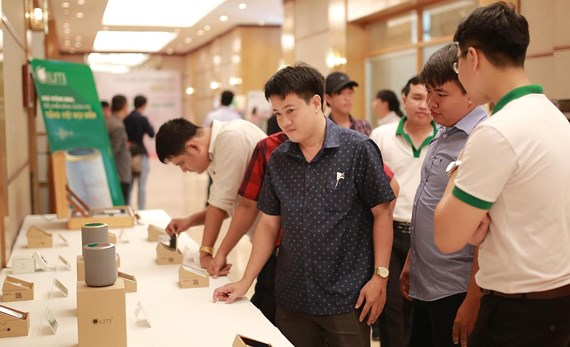

Nhiều khách hàng đã và đang biết được tiện ích của nhà thông minh Lumi và cũng đang muốn tìm hiểu để lắp đặt nhưng hiện tại vẫn chưa biết được nên mua những thiết bị đó ở đâu cho đảm bảo và an toàn, Vì đó thật ra đây cũng là phải bỏ một số tiến không nhỏ để lắp đặt hệ thống nhà thông minh này. Chính vì vậy việc băn khoăn không biết mua thiết bị đó ở đâu là câu hỏi của nhiều khách hàng.

Hãy đến với Gia Hân group trụ sở chính tại Số 304 Nguyễn Đình Tựu, Q.Thanh Khê Đà Nẵng, ngoài ra Gia Hân còn có thể phân phối toàn quốc và có đội ngũ nhân viên lắp đặt đầy kinh nghiệm, nhiệt tình.

**NHỮNG HỎI ĐÁP CỦA KHÁCH HÀNG**

## 1. Quá trình lắp đặt nhà thông minh có gây ảnh hưởng gi tới hệ thống trong nhà hay không?

Ngôi nhà của bạn đã xây dựng tư lâu nhưng hiện nay bạn muốn lắp đặt nhà thông minh, hay nhà bạn mới hoàn thành và đưa vào sử dụng. Nhưng sau khi tìm hiểu thông tin về nhà thông minh bạn muốn lắp đặt hệ thống này cho ngôi nhà mình đang ở. Những băn khoăn về việc lắp đặt có ảnh hưởng gì tới hệ thống cấu trúc ngôi nhà hay không? Có cần phải đục tường ay đi lại dây, hay mạch điện hay không..?

Với các thiết bị điện thông minh Lumi, bạn hoàn toàn có thể sử dụng hệ thống dây điện cũ để lắp đặt. Bạn không cần phải đục từng hay đi lại đường dây điện mới.

Các thiết bị điện thông minh đều được kết nối với nhau qua công nghệ truyền thông không dây. Nên bạn hoàn toàn sử dụng được những thiết bị điện cũ và mới mà không ảnh hưởng tới cấu trúc của ngôi nhà.

## 2. Lắp đặt một ngôi nhà thông minh mất bao nhiêu thời gian?

Việc lắp đặt nhà thông minh không hề mất nhiều thời gian như bạn tưởng. Do tất cả các thiết bị đều được sử dụng và kết nối với nhau qua công nghệ truyền thông không dây. Nên việc lắp đặt và cấu hình hệ thống nhà thông minh chỉ mất từ 1 đến 3 ngày phụ thuộc vào số lượng thiết bị điện thông minh của nhà bạn.

## 3. Nhà thông minh có dễ sử dụng hay không?

Nhà thông minh rất dễ sử dụng và an toàn với cả người già và trẻ nhỏ. Việc sử dụng nhà thông minh rất đơn giản, bạn có thể sử dụng dễ dàng thông qua các kênh điều khiển như smartphone, ipad hay điều khiển giọng nói.

## 4. Giá nhà thông minh có đắt không?

Thông thường, với nhiều người cứ nhắc đến những từ khóa như: công nghệ mới, thông minh, hiện đại,.. thì luôn đi kèm với chi phí cao và phức tạp. Nhưng nhà thông minh thì đơn giản hơn nhiều. Bạn chỉ cần bỏ ra một mức chi phí từ 20 -30 triệu là có thể sở hữu ngay một ngôi nhà thông minh cho căn hộ chung cư của mình.

Là một trong những đại lí lớn cung cấp và kinh doanh thiết bị điện thông minh Lumi. Chúng tôi sẽ làm hài lòng khách hàng với những giải pháp mà chúng tôi đưa ra cho bạn.

Để biết thêm nhiều thông tin hơn về sản phẩm, cách sư dụng và lợi ích chức năng của sản phẩm xin vui lòng liên hệ cho chúng tôi để được tư vấn theo thông tin địa chỉ va đường dây nóng dưới đây.

Địa chỉ: Số 304 Nguyễn Đình Tựu, Q.Thanh Khê, TP. Đà Nẵng

Hotline: 0968.333.268 - 0935.333.268

Email: [GiahanGroup2018@gmail.com](mailto:GiahanGroup2018@gmail.com)