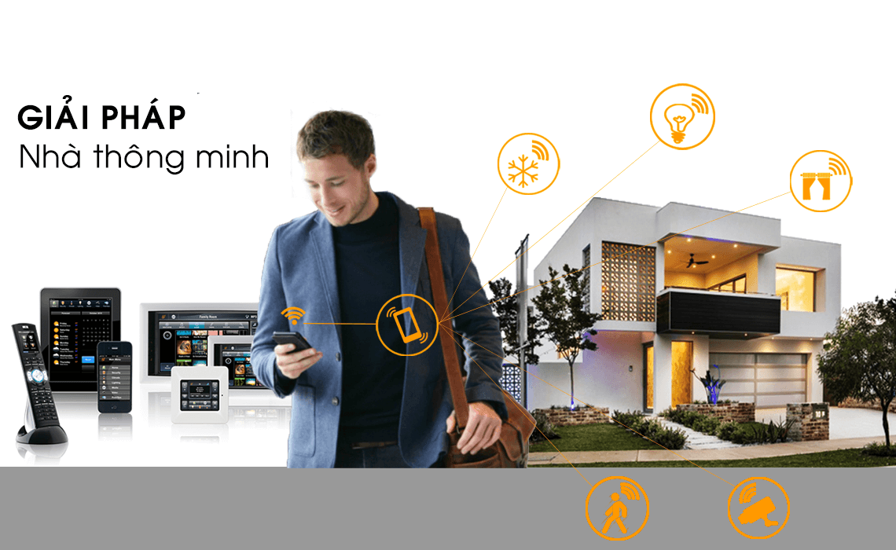
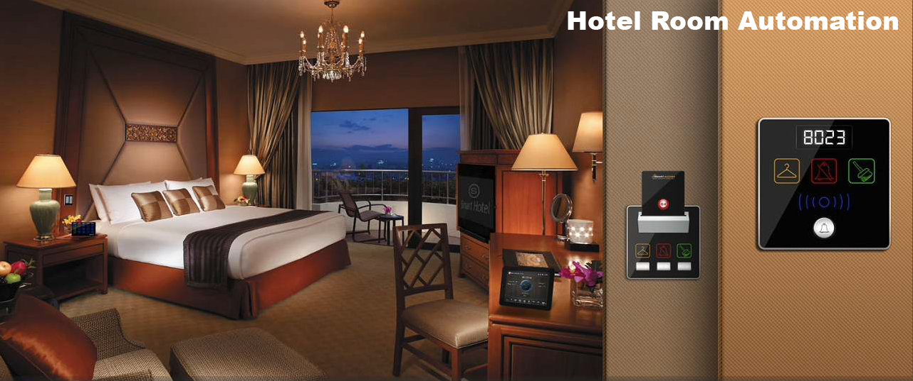

**Theo phân tích số liệu  của các cá nhân cũng như các tổ chức chuyên nguyên cứu đánh giá về tỷ lệ tăng trưởng, doanh thu nền công nghiệp 4.0 gọi tắt là AI, để đáp ứng lại nhu cầu quan tâm sử dụng và dự kiến nhu cầu sử dụng nhà thông minh dự kiến sẽ tăng mạnh vào các năm tới lộ trình tới năm 2025. Bước chạy đà hoàn hảo mở ra cơ hội phát triển kinh doanh kinh tế mạnh mẽ và bùng nổ cho những quốc gia, tổ chức các cá nhân có định hướng phát triển theo ngành hàng này.**

Cơ sở dữ liệu  thu thập được do các tổ chức phi chính phủ công bố  năm 2018 thông báo cơ hội tuyệt vời cho doanh nghiệp, cá nhân những cơ hội phát triển thị trường. Số liệu đánh giá chỉ số hiểu biết, quan tâm của người tiêu dùng về ngôi nhà thông minh theo những khái niệm khác nhau. Điều đó mô tả về một thị trường nhà thông minh tiềm năng hứa hẹn đem lại nhiều thay đổi trong thời gian tới đây

Cùng với sự chững lại của nền kinh tế thế giới, nền công nghiệp cũng bị ảnh hương rất lơn nhưng thị trường và xu thế nhà thông minh lại đi ngược lại quy luật tất yếu của nền kinh tế đang bị ảnh hưởng nhiều. Hãy cùng nhìn về 4 năm trước, tỉ lệ tăng trưởng về nhà thông minh là 17,48% từ 21.500 triệu đô tăng lên 34.860 triệu đô vào năm 2017 (theo báo cáo của tổ chức 
BisReport analysts)
. Qua những số liệu này, chúng ta hoàn toàn có căn cứ để kết luận có thể tin tưởng rằng, nhà thông minh sẽ chạm mức đỉnh trong thời gian tới tới.

Có hàng trăm thương hiệu nổi bật về Smart Home trên thế giới, trong đó hầu hết nhắm vào ngành hàng Nhà thông minh (Smart Home), Văn phòng thông minh (Smart Office), Khách sạn thông minh (Smart Hotel), thành phố thông minh (Smart City)…

Hai trong nhiều gói giải pháp thực sự được quan tâm và mong đợi nhất vì nó cần thiết và vô cùng quan trọng với tất cả 
 Điều khiển chiếu sáng (Lighting control), An ninh và điều khiển truy cập (Security and Acess Control). 
 
Trong giai đoạn từ tháng 7/2017 – 7/2018 có 276.000 lượt tìm kiếm về “Smart house” trên thế giới và gần 3 triệu lượt tìm kiếm về từ khóa “nhà thông minh” tại Việt Nam 
(Theo thống kê google adwords).

Nếu trên thế giới có những tên tuổi lâu đời như Honeywell, Seimens, Schneider,… thì Việt Nam cũng đã có thương hiệu tiêu biểu và nổi bật hiện nay là nhà thông minh Lumi. Được khách hàng yêu thích và sử dụng nhiều tại Việt Nam, bởi vìLumi là đơn vị dẫn đầu về phát triển giải pháp và nghiên cứu xu thế thị trường. Hợp tác cùng những đơn vị lớn trên thế giới để tạo nên những sản phẩm tuyệt vời với phương châm người Việt Dùng đồ Việt

Hãy cùng đồng hành cùng Giahansmarthome cũng như SP LUMI hàng Việt Nam Thương Hiệu Việt nam!

Địa chỉ: Số 304 Nguyễn Đình Tựu, Q.Thanh Khê, TP. Đà Nẵng

Hotline: 0968.333.268 - 0935.333.268

Email: [GiahanGroup2018@gmail.com](mailto:GiahanGroup2018@gmail.com)