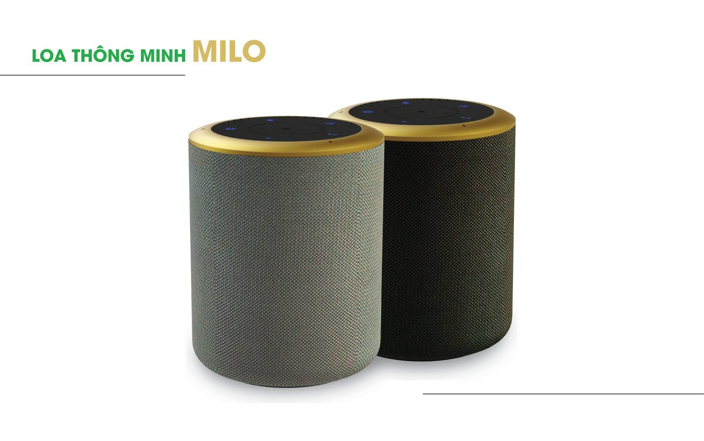

**Cuộc đua trí tuệ nhân tạo (AI) đang và trong tương lại sẽ không có điểm dừng, các doanh nghiêp, công ty phát triển công nghệ phần mềm Việt Nam đang cố tạo ra các sản phẩm gần gũi hơn tiện lợi hơn cho tất cả người sử dụng. Và liệu rằng các công ty này sẽ trình làng những sản phẩm trí tuệ nhân tạo nào trong thời sắp tới. Hiện tại trí tuệ nhân tạo đang được ứng dụng nhiều nhất trong các lĩnh vưc như giáo dục, tài chính ngân hàng, trợ lí ảo giúp các gia đinh giảm bớt công việc thường ngày. các ông lớn trong nghành công nghệ đã tạo ra AI (Artificial Intelligence) giúp hoặc thay thế con người 1 hoặc nhiều lĩnh vực nào đó.**

* Google đã và đang ứng dụng AI vào lĩnh vực xe tự hành
* Facebook sử dụng trí tuệ nhân tạo trong việc nhận diện hình ảnh
* Microsoft đang theo đuổi dự án điều trị ung thư bằng trí trí tuệ nhân tạo
* Google ứng dụng AI trong việc nhận diện giọng nói.

Trong tương lai không xa cuộc sống của bạn sẽ trở nên tiện ích hơn rất nhiều vì đã có ứng dụng trí tuê nhân tạo.

Các sản phẩm sử dụng trí tuệ nhân tạo như loa Amazon Eco hay Google Home đã có mặt trong các ngôi nhà, kết nối với các thiết bị trong nhà như điện thoại di động, đồ gia dụng. Chỉ cần ra lệnh bằng giọng nói là có thể điều khiển mọi thiết bị trong nhà mà không cần động tay vào.

Những chiếc ô tô tự hành - sản phẩm của trí tuệ nhân tạo cũng đang xuất hiện ngày càng nhiều trong cuộc sống. Với ô tô tự hành, con người được giải phóng toàn bộ, tận hưởng khoảng thời gian nghỉ ngơi trên xe. Vocal IQ chính là tác giả của công nghệ kiểm soát giọng nói trên các mẫu xe của General Motors, cho phép người lái có thể bật hoặc tắt những chức năng nhất định trên xe hơi bằng lệnh thoại.
Facebook - Mạng xã hội đang dùng công nghệ trí tuệ nhân tạo để giúp người khiếm thị có thể "nhìn thấy" ảnh qua một ứng dụng trên iOS. Ngoài ra, công nghệ này còn được Facebook dùng để tạo các bản đồ chi tiết về dân số và người truy cập Internet toàn cầu. Mục đích là giúp hãng này triển khai dự án phổ cập Internet tới các vùng xa xôi, hẻo lánh.

**Còn doanh nghiệp Việt Nam thì sao?**

LUMI  Là công ty Việt Nam đầu tiên phát triển được một chiếc loa thông minh điều khiển các thiết bị điện tử trong gia đình bằng ngôn ngữ Tiếng Việt tự nhiên đã ra đời sau nỗ lực phát triển của người Việt. Với tên gọi Milo, chiếc loa này ngoài khả năng phát nhạc thì còn được kết nối với Internet, nhận lệnh điều khiển bằng giọng nói tiếng Việt của người dùng nhằm thực hiện những tác vụ điều khiển các thiết bị trong nhà thông minh như tắt mở đèn, đóng mở rèm, bật tắt điều hòa nhiệt độ,…Tất cả đều được ra lệnh một cách tự nhiên bằng ngôn ngữ tiếng Việt, bất kể là vùng miền nào, hễ tiếng Việt là loa sẽ hiểu được. Để điều khiển, người dùng sẽ gọi loa bằng “OK Milo”, sau đó yêu cầu nó “bật đèn ngủ, đóng rèm, bật máy lạnh,…” tương tự như cách mà Google Home hoặc Alexa hay Siri điều khiển các thiết bị điện trong nhà thông qua tiếng Anh. Đáng chú ý hơn, hệ thống nhận diện ngôn ngữ của Milo sẽ liên tục được hoàn thiện bằng công nghệ machine learning, cho phép nó hiểu được không chỉ các câu lệnh rõ ràng mà cả những câu ghép, các câu liền kề nhau và những câu cảm thán. Thí dụ như chỉ cần bạn nói phòng tối quá, Milo sẽ tự mở đèn,…

Trí tuệ nhân tạo là thứ không thể sờ, nắm nhưng nó là một công nghệ thú vị và được ứng dụng ngày càng nhiều trong các lĩnh vực khác nhau, từ việc phục vụ đời sống hàng ngày của con người cho đến giáo dục, tài chính ngân hàng, y tế. Ứng dụng thực tế của trí tuệ nhân tạo có thể giúp nâng cao hiệu suất lao động, cải thiện chất lượng sống của con người, đem đến cơ hội tăng trưởng kinh tế, phát triển kinh doanh cho các doanh nghiệp.