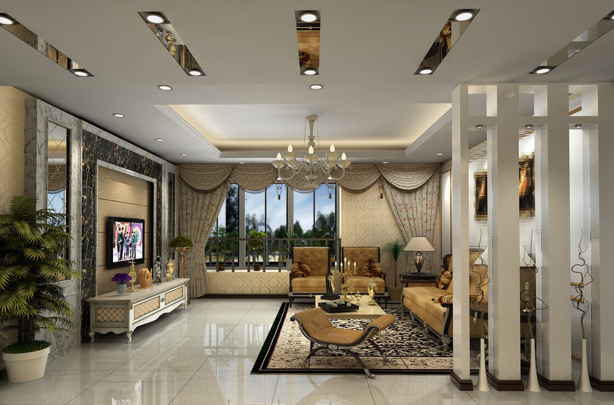
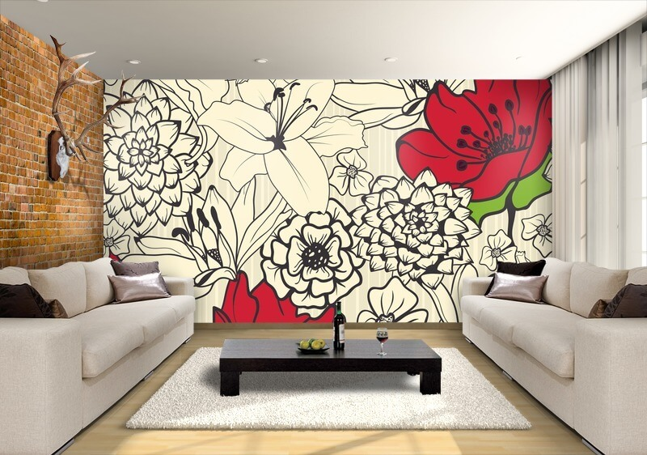
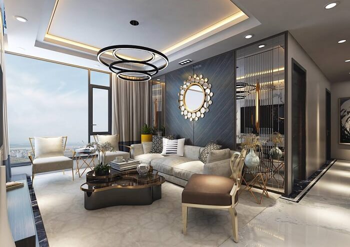
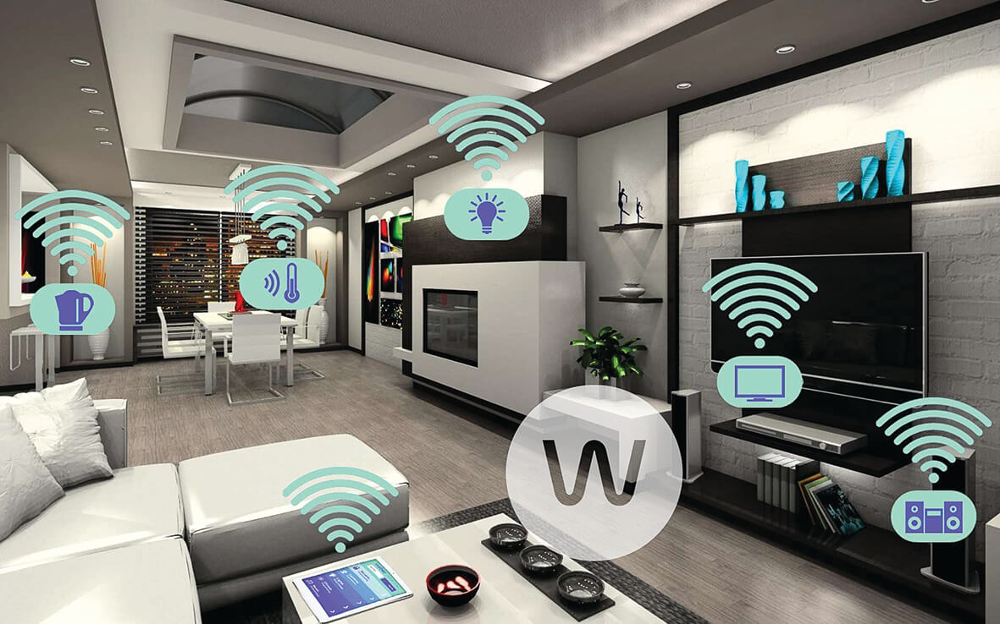

Bạn đang muốn thiết kế lại ngôi nhà theo hướng hiện đại hơn nhưng vẫn chưa nghĩ ra ý tưởng gì? Bài viết này sẽ đưa ra những xu hướng thiết kế nội thất ngôi nhà mang đến cho bạn một không gian có tính tiện lợi cao mà vẫn không kém phần tinh tế.

**Hãy tham khảo nhé!**

## Giấy dán tường

Mặc dù giấy dán tường là sự lựa chọn không còn mới mẻ hay độc đáo để trang trí nhà. Tuy nhiên nhờ ưu điểm như chi phí thấp, tiện dụng nhưng vẫn đảm bảo về mặt thẩm mỹ cho ngôi nhà. Nên xu hướng này vẫn đang được rất nhiều người yêu thích. Bên cạnh đó, giấy dán tường hiện nay rất đa dạng về chủng loại, màu sắc cũng như mẫu mã chính vì vậy tùy thuộc vào nhu cầu, sở thích của gia chủ mà có những lựa chọn phù hợp hơn.

## Hướng về thiên nhiên

Bằng cách đặt một vài cây cảnh trong nhà không những làm ngôi nhà của bạn mới mẻ hơn mà còn đem lại cảm giác gần gũi với thiên nhiên. Ngoài ra, đối với những căn hộ có phòng ngủ hay phòng khách hướng ra bên ngoài thì việc lắp những ô cửa kính trong suốt sẽ làm cho căn phòng trở nên thoáng mát hơn. Gia chủ có thể thư giản bằng việc vừa nhâm nhi một tách trà vừa ngắm quan cảnh bên ngoài, cảm giác sẽ vô cùng thư thái.

## Nhà thông minh

Nhà thông minh thật sự đang trở thành một xu hướng mới trong các gia đình Việt. Bằng cách lắp đặt các thiết bị điện thông minh cho ngôi nhà của bạn, việc điều khiển, giám sát, quản lý mọi hoạt động của ngôi nhà sẽ trở nên dễ dàng hơn bao giờ hết. Bên cạnh đó, bạn có thể thoải mái đi công tác xa, đi du lịch nước ngoài mà vẫn có thể quan sát ngôi nhà với giải pháp an ninh thông qua các thiết bị di động.

Hơn nữa, các tính năng của nhà thông minh không chỉ dừng lại ở việc điều khiển qua smartphone mà còn có thể điều khiển bằng giọng nói. Đây cũng chính là lý do tại sao mà xu hướng này đang rất thịnh hành.

Hãy liên hệ với Gia Hân để sở hữu giải pháp nhà thông minh Lumi và tận hưởng trọn vẹn cuộc sống tiện nghi đẳng cấp ngay hôm nay.

Địa chỉ: Số 304 Nguyễn Đình Tựu, Q.Thanh Khê, TP. Đà Nẵng

Hotline: 0968.333.268 - 0935.333.268

Email: [GiahanGroup2018@gmail.com](mailto:GiahanGroup2018@gmail.com)