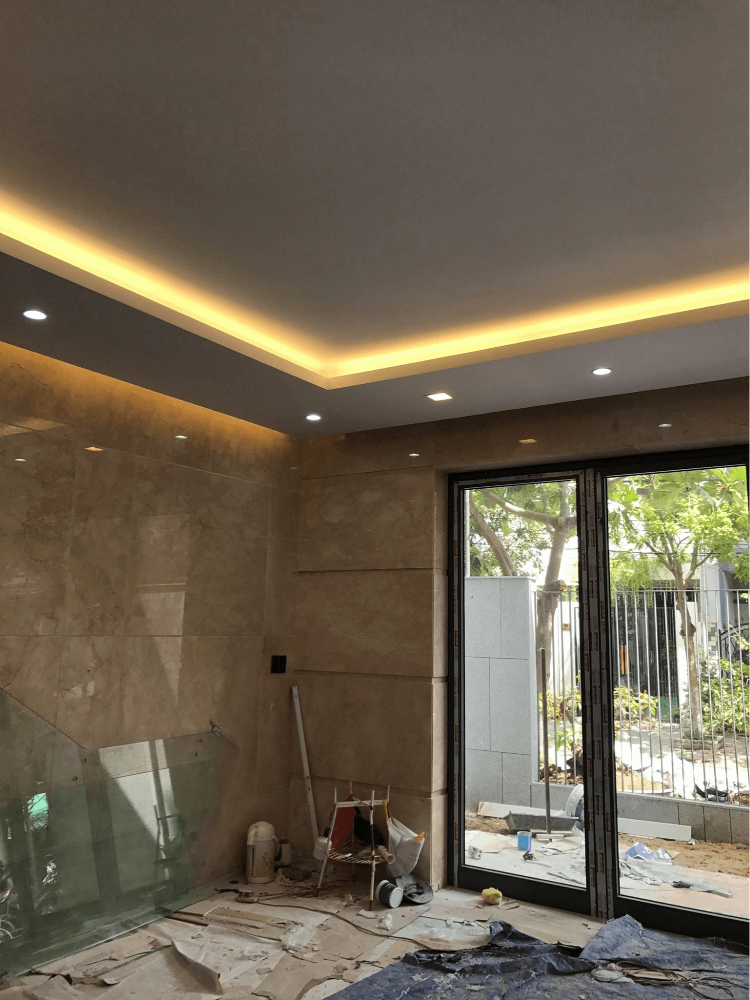
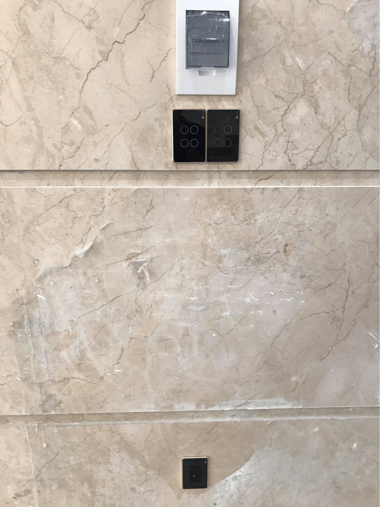

**Công trình được Gia Hân thiết kế căn hộ thông minh Smarthome nằm quận Thanh Khê. Đây là một trong những công trình sử dụng giải pháp căn hộ thông minh Lumi vừa được các kỹ sư Gia Hân hoàn thiện đảm bảo tiêu chí “Ngôi nhà chất - đáng sống thời 4.0. **

_Công trình nhà thông minh cô Hường quận Thanh Khê_

**Thi công giải pháp ánh sáng an ninh cho nhà cô Hường quận Thanh Khê.**

Là người khá cầu toàn và kỹ tính, chị Hường yêu cầu tất cả sản phẩm nội thất, thiết bị công nghệ trong nhà đều phải toát lên sự sang trọng, đẳng cấp và tiện nghi. Bên cạnh đó, chị cũng mong muốn có 1 giải pháp thiết kế cho căn hộ thông minh Smarthome 1 cách toàn diện. Dựa trên yêu cầu và mong muốn này, Gia Hân đã thiết kế và triển khai các giải pháp thi công bao gồm:

_Hệ thống đèn chiếu sáng_

Hệ thống đèn hành lang, cầu thang sử dụng công nghệ cảm ứng. Chủ nhà có thể điều khiển tích hợp các hệ thống thiết bị chiếu sáng từ xa, hoặc điều khiển cảm ứng chạm thông qua công tắc tự động, công tắc thông minh.

_Hệ thống đèn chiếu sáng điều khiển từ xa_

Thiết bị điện thiết kế tinh tế, mặt kính cảm ứng cường lực – viền nhôm hiện đại. Các công tắc thông minh bản vuông – màu đen kết hợp với không gian và nội thất tổng thể của căn hộ đã tạo nên sự hiện đại và vẻ ấn tượng đặc biệt, thanh lịch và sang trọng. Công tắc tự động Lumi mang đến cảm giác thoải mái và tiện nghi cho gia chủ, tạo nên một không gian sống “chất - đáng sống thời 4.0”.

_Thiết bị điện thông minh nhiều tiện ích với thiết kế tinh tế_

_Giải pháp an ninh_

Cùng với hệ thống chiếu sáng, Gia Hân thiết lập giải pháp an ninh và cảnh báo chống trộm 24/7. Cảm biến cửa chống trộm giúp phát hiện sự xâm nhập trái phép làm đóng mở cửa và kích hoạt thiết bị cảnh báo đồng thời sẽ báo tín hiệu về điện thoại hoặc máy tính bảng để người dùng biết và có những biện pháp xử lý phù hợp. Hệ thống camera giám sát sẽ bảo vệ ngôi nhà 24/24, giúp bạn phát hiện nhanh những hành động, dấu hiệu lạ xung quanh ngôi nhà. Ngoài ra còn có các thiết bị báo động cùng hoạt động khi phát hiện xâm nhập lạ như: còi hú, đèn chiếu sáng,..và thiết bị xử lý trung tâm sẽ gửi cảnh báo đến điện thoại hoặc gmail của bạn.
Tất cả các giải pháp đều dễ dàng điều khiển bằng giọng nói hoặc trên smartphone. Với các tính năng linh hoạt, sự tiện nghi và nét tinh tế trong từng thiết bị Gia Hân cung cấp, gia chủ đã thực sự bị thuyết phục. Để tạo nên không gian sống lý tưởng cho ngôi nhà, chúng tôi thi công các hạng mục đáp ứng những tiêu chí khắt khe nhất.

_5 lý do nên lựa chọn Gia Hân làm đơn vị thi công_

Sở hữu nhiều ưu thế vượt trội, Gia Hân trở thành đơn vị thiết kế thi công giải pháp nhà thông minh được hàng trăm công trình Việt tin dùng.
Giải pháp của Lumi mang lại sự tiện ích vượt trội cho khách hàng bởi sự đơn giản và dễ dàng sử dụng. Thời gian thi công nhanh chóng chỉ với 1 đến 2 ngày thi công bất kể công trình cũ hay mới mà không cần đục đẽo.
Gia Hân còn có chính sách bảo hành & bảo trì sản phẩm độc nhất kéo dài đến 24 tháng đi kèm với chế độ kiểm tra định kỳ từ 3 tháng đến 6 tháng/ 1 lần để đánh giá chất lượng sản phẩm trong quá trình sử dụng của khách hàng.

100% sản phẩm đạt nhận được chứng chỉ CE – tiêu chuẩn xuất khẩu sang các nước Châu  u và chứng chỉ UL – được xuất khẩu đến 104 quốc gia trên thế giới. Hiện nay, sản phẩm của Lumi đã xuất khẩu tới 6 nước trên thế giới: Thái Lan, Australia, Ấn Độ, Lào, Campuchia Đặc biệt, mức giá thiết kế thi công chỉ bằng 1/3 so với các giải pháp tương tự trên thị trường. Chỉ từ 25 – 70 triệu/căn hộ hoặc 40 – 150 triệu/biệt thự liền kề là bạn đã sở hữu ngay ngôi nhà tiện nghi, hiện đại, sang trọng, đẳng cấp Châu  Âu.

Sự tín nhiệm của các đối tác và hàng nghìn khách hàng đang sử dụng giải pháp nhà thông minh Lumi do Gia Hân cung cấp là bằng chứng thực thuyết phục nhất về chất lượng phục vụ của chúng tôi. Với hàng trăm công trình căn hộ, ngôi nhà, biệt thự, văn phòng cao ốc...đã và đang hoàn thiện, Gia Hân tự hào trở thành đơn vị cung cấp và thi công nhà thông minh hàng đầu hiện nay.

Liên hệ ngay 0968.333.268 - 0935.333.268 để tạo nên điều kỳ diệu cho ngôi nhà của mình bạn nhé! 

