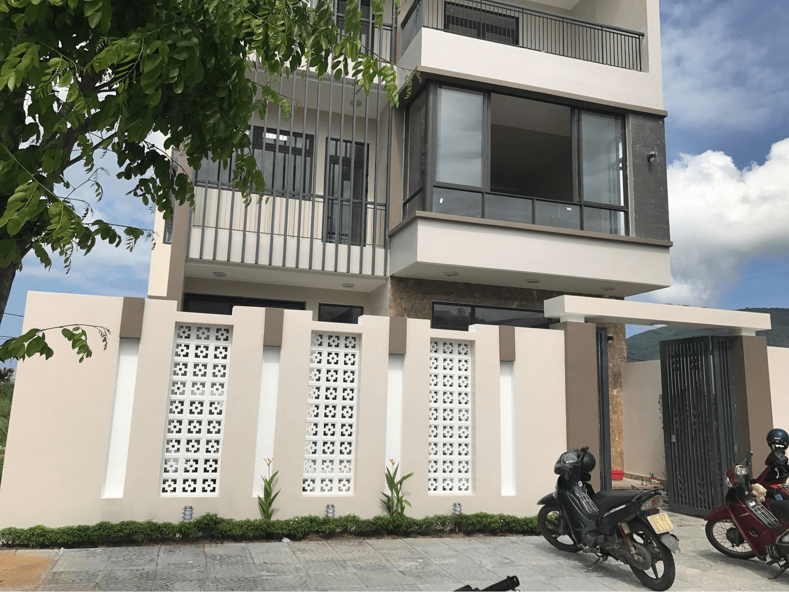
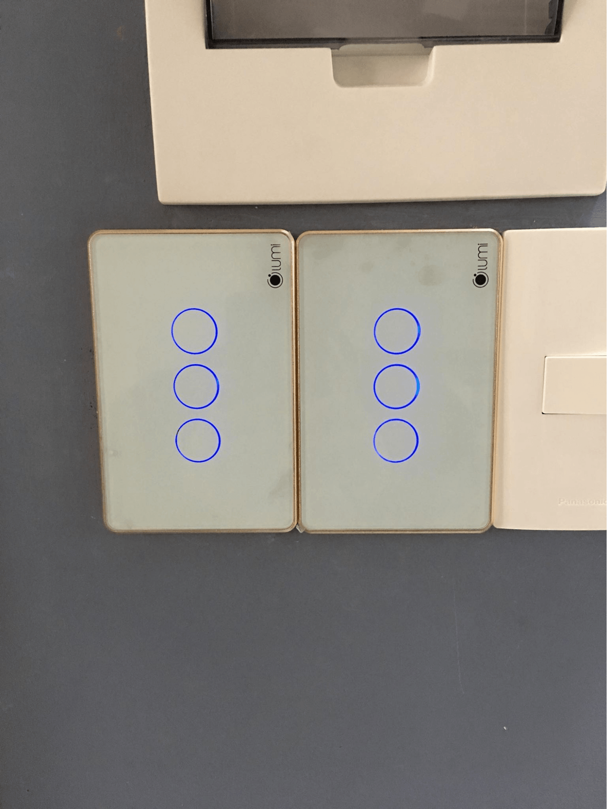
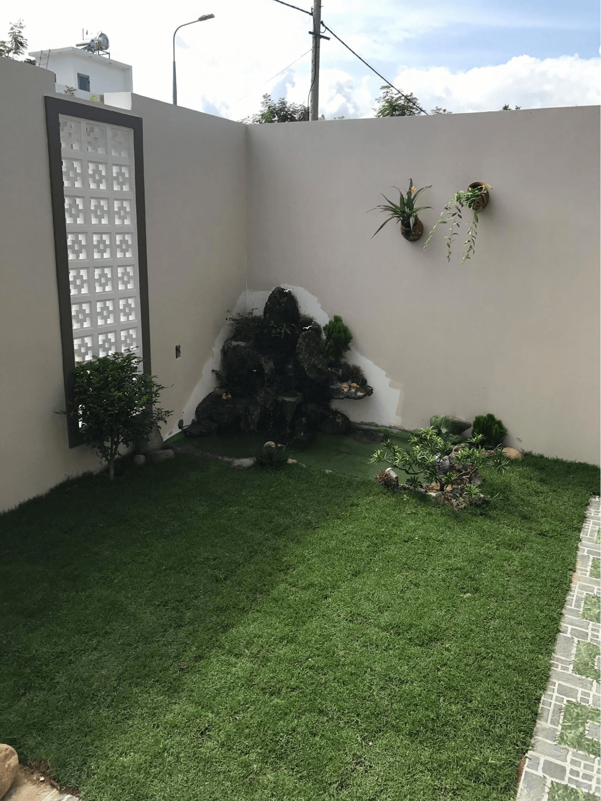
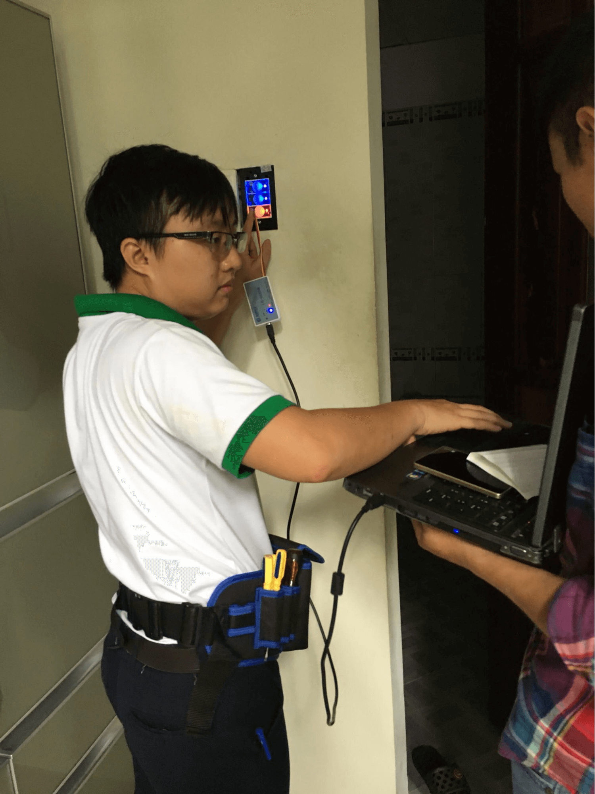
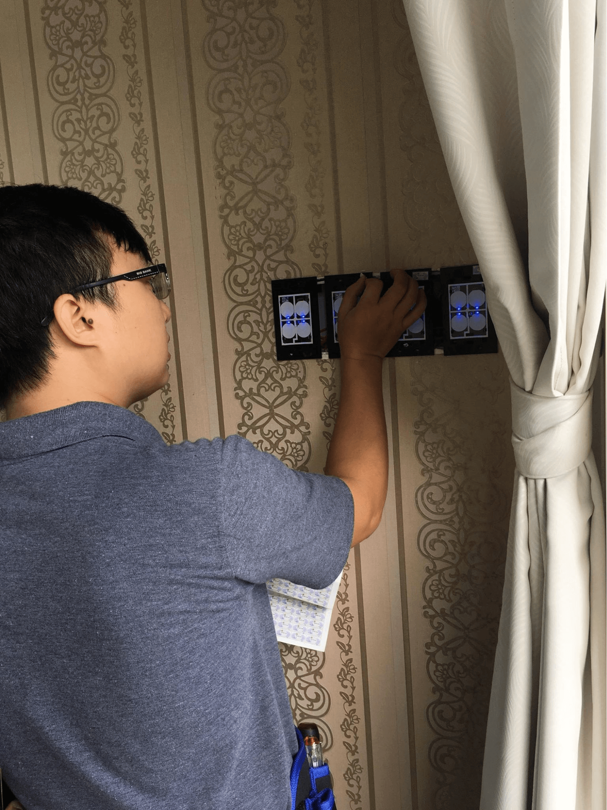
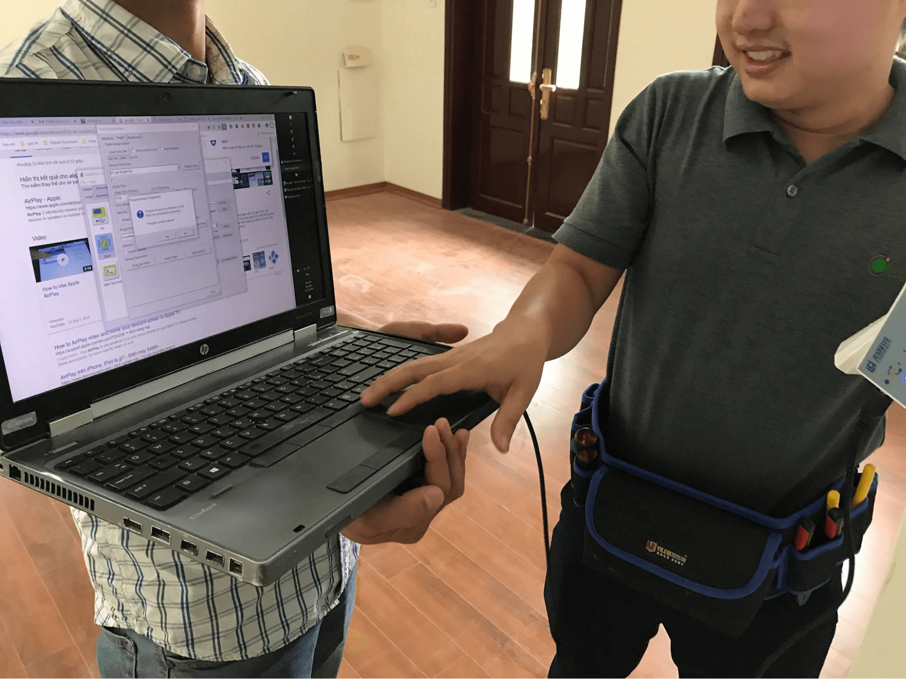

Công trình văn phòng tại Tổng công ty Việt Nam là một trong những dự án nhà thông minh do Gia Hân thiết kế và thi công. Định kỳ 6 tháng, Gia Hân tiến hành bảo trì để kiểm tra hoạt động cũng như xử lý các vấn đề phát sinh khi sử dụng. Quá trình này được tiến hành liên tục trong vòng 24 tháng và cam kết 1 đổi 1 trên toàn đại lý, chi nhánh của Lumi trên toàn quốc. Hãy cùng theo dõi quá trình bảo hành định kỳ của Gia Hân tại công trình Tổng công ty Việt Nam.

_Công trình nhà thông minh tại Tổng công ty Việt Nam_

Quy trình bảo trì công trình Tổng công ty Việt Nam
Tổng công ty Việt Nam lựa chọn gói giải pháp nhà thông minh Lumi VIP mang lại sự tiện nghi tối đa cho người sử dụng. Đây là công trình sử dụng hệ thống công tắc điều khiển từ xa cảm ứng kết nối không dây và gói giải pháp nhà thông minh Lumi. Điều khiển tích hợp các hệ thống thiết bị chiếu sáng, điều hòa không khí, rèm cửa … từ xa, hoặc điều khiển cảm ứng chạm thông qua công tắc tự động, công tắc thông minh.

Để thiết kế thi công giải pháp nhà thông minh cho một đơn vị doanh nghiệp hàng đầu như Tổng công ty Việt Nam, Gia Hân phải đáp ứng nhiều yêu cầu khắt khe về kỹ thuật. Toàn bộ các thiết bị điện thông minh đều phải đảm bảo chức năng và sở hữu thiết kế đẳng cấp. Hoạt động của các thiết bị điện được vận hành một cách tự động cùng các tính năng linh hoạt, sự tiện nghi và nét tinh tế trong từng thiết bị đã hoàn toàn thuyết phục đơn vị khách hàng khó tính này.

_Thiết bị điện thông minh đảm bảo chức năng và sở hữu thiết kế đẳng cấp_

_Một góc công trình nhà thông minh tại Tổng công ty Việt Nam_

Sau khi hoàn thiện và bàn giao công trình cho Tổng công ty Việt Nam, Gia Hân liên tục tiến hành bảo trì các thiết bị định kỳ 6 tháng/lần trong suốt 2 năm. Cụ thể, các hạng mục bảo trì định kỳ tại công trình tổng công ty Việt Nam bao gồm: 
- Kiểm tra bộ điều khiển trung tâm
- Kiểm tra bảo trì thiết bị thông minh như ổ cắm, công tắc điều khiển từ xa, công tắc cảm ứng (cảm ứng chuyển động, ánh sáng, nhiệt độ, báo cháy...)
- Kiểm tra hoạt động kết nối của các thiết bị sử dụng điện như đèn, điều hòa, bình nóng lạnh, mô-tơ điều khiển đóng mở cửa/rèm...
- Kiểm tra cổng kết nối với điện thoại, máy tính, màn hình điều khiển LCD hoặc Touch Panel…

_Kiểm tra cổng kết nối với điện thoại, máy tính_

_Kiểm tra bảo trì thiết bị thông minh (ổ cắm, công tắc cảm ứng…)_

Gia Hân - đơn vị thi công thiết kế bảo trì giải pháp nhà thông minh hàng đầu hiện nay
Với mỗi công trình, Gia Hân đều tận tâm từ khâu thiết kế thi công cho đến bàn giao, bảo trì. Đảm bảo 2 yếu tố then chốt: thi công nhanh chóng và bảo hành lâu dài. 
Là thành viên của một trong những đơn vị Nhà thông minh hàng đầu Việt Nam với hệ thống nhà phân phối rộng khắp từ Bắc vào Nam, Gia Hân cung cấp đầy đủ trọn gói các sản phẩm dịch vụ từ thiết kế thi công đến xây mới, cải tạo. 

Các sản phẩm đạt chứng chỉ CE – tiêu chuẩn xuất khẩu sang các nước Châu  Âu và chứng chỉ UL – được xuất khẩu đến 104 quốc gia trên thế giới. Gia Hân mang đến cho khách hàng các giải pháp, thiết bị điện thông minh tiên tiến hàng đầu.

Mức giá thiết kế thi công chỉ bằng 1/3 so với các giải pháp tương tự trên thị trường. Chỉ từ 25 – 70 triệu/căn hộ hoặc 40 – 150 triệu/biệt thự liền kề là bạn đã sở hữu ngay ngôi nhà tiện nghi, hiện đại, sang trọng, đẳng cấp Châu  Âu, giá chỉ bằng 1/2 giải pháp nhập khẩu trên thị trường.

Đặc biệt, chính sách bảo hành & bảo trì sản phẩm độc nhất kéo dài đến 24 tháng đi kèm với chế độ kiểm tra định kỳ từ 3 tháng đến 6 tháng/ 1 lần để đánh giá chất lượng sản phẩm trong quá trình sử dụng của khách hàng. Công trình của bạn sẽ thường xuyên được chăm sóc bởi đội ngũ nhân sự chất lượng cao gồm các kiến trúc sư, kỹ thuật viên, nhân viên chăm sóc khách hàng...

_Chính sách bảo hành & bảo trì sản phẩm độc nhất kéo dài đến 24 tháng_

Với những ưu thế đó, Gia Hân trở thành đơn vị thiết kế thi công giải pháp nhà thông minh được hàng trăm công trình Việt tin dùng.

Hãy liên hệ ngay với Gia Hân để được tư vấn miễn phí các giải pháp nhà thông minh cho căn hộ, biệt thự cho văn phòng cao ốc. 

