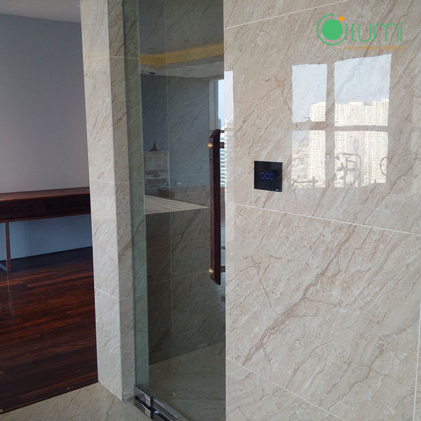
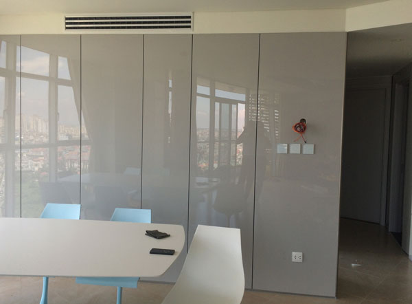
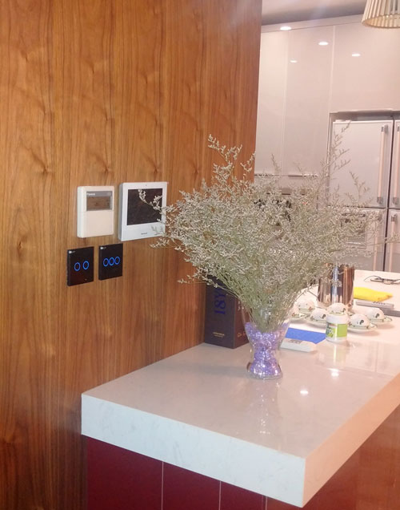
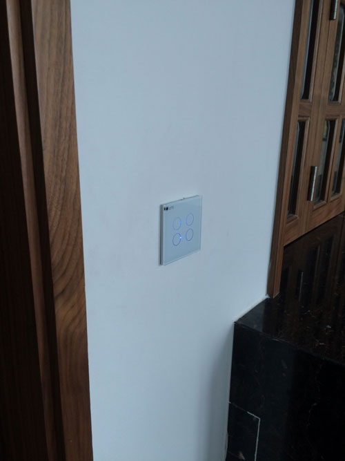
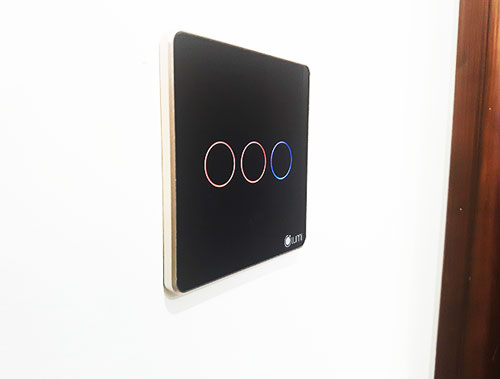
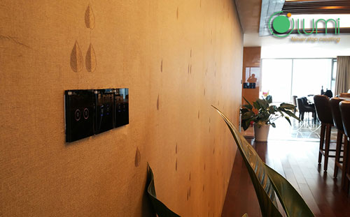

## BÁO GIÁ GÓI GIẢI PHÁP NHÀ THÔNG MINH LUMI CHO CHUNG CƯ

_### Chỉ từ 30 – 70 triệu bạn đã có ngay một căn nhà thông minh hoàn hảo_

(Giải pháp áp dụng cho căn hộ chung cư có diện tích từ 60 – 92 m2)
Để nhà thông minh không còn xa xỉ với người dùng, Lumi Việt Nam đã tối ưu hóa và cho ra mắt nhiều gói sản phẩm phù hợp với giá thành, điều kiện của người dùng. Chỉ từ 30 triệu đồng, khách hàng đã sở hữu ngay căn hộ thông minh, tiện nghi, đẳng cấp Châu Âu tại Việt Nam.
Giải pháp đáp ứng đầy đủ các tiêu chuẩn của một ngôi nhà hiện đại gồm: hệ thống chiếu sáng, điều hòa, rèm cửa, bình nóng lạnh, âm thanh, quạt... được điều khiển và kiểm soát trên Smartphone, máy tính dù ở bất cứ nơi đâu khi được kết nối Internet. Đặc biệt, với loa MILO điều khiển bằng giọng nói tiếng Việt, chỉ cần nói “Ok Milo, kích hoạt cảnh ra ngoài” ngay lập tức các thiết bị điện trong ngôi nhà tắt trong tích tắc.  
 
### Hệ thống chiếu sáng thông minh

Một chạm – vạn tiện nghi: Thông thường để điều khiển tất cả các thiết bị trong nhà cần đi tới hàng chục công tắc. Với Lumi, bạn chỉ cần một chạm nhẹ trên smartphone hay máy tính bảng khi được kết nối internet, để bật/tắt toàn bộ thiết bị điện trong nhà dù ở bất cứ đâu.
 
Chủ nói – nhà nghe: Với loa thông minh điều khiển bằng giọng nói tiếng Việt, việc bật/tắt các thiết bị cũng trở nên dễ dàng. Chỉ cần nói những câu thoại đơn giản, dù giọng miền Bắc, Trung, hay miễn Nam loa MILO vẫn hiểu và thực hiện yêu cầu một cách dễ dàng. 
 
Hơn cả sự tiện nghi: Người dùng có thể thiết lập các hoạt cảnh lặp lại hằng ngày cho ngôi nhà như: “Về nhà”, các thiết bị bình nóng lạnh, quạt thông gió, điều hòa, rèm cửa mở… sẽ bật sẵn và cho bạn không gian thoải mái. Hay các chế độ “xem phim”, “vắng nhà”, “đi ngủ”.
 
### Hơn cả sự tiện nghi

Bạn có thể thiết lập các hoạt cảnh lặp lại hằng ngày cho ngôi nhà như: “Về nhà”, một hệ thống gồm: bình nóng lạnh, quạt thông gió, điều hòa, rèm cửa mở … sẽ bật sẵn và cho bạn không gian thoải mái. Hay các chế độ “xem phim”, “vắng nhà”, “đi ngủ”.
 
### Điều khiển rèm

Nhà thông minh Lumi, cho phép bạn điều khiển hệ thống rèm từ xa. Ngoài ra, còn điều khiển theo các ngữ cảnh đã được lập trình sẵn như: tiếp khách, xem phim, đi ngủ… Đặc biệt, ngoài điều khiển riêng từng rèm, chúng ta cũng điều khiển được nhiều rèm cùng 1 lúc.

_Điều khiển rèm_

### Điều khiển từ xa với điều hòa và bình nóng lạnh

Hệ thống điều hòa, bình nước nóng sẽ tự động làm việc theo khung giờ cài đặt sẵn, chỉ cần 1 chạm trên smartphone từ xa bạn có thể điều chỉnh được các chế độ phù hợp với sức khỏe cho cả gia đình. Câu chuyện “QUYÊN” tắt cũng sẽ được gác lại với hệ thống các thiết bị đều được kiểm soát trên điện thoại, máy tính.
 
### An toàn với hệ thống an ninh 

Hệ thống camera giám sát, bảo vệ ngôi nhà 24/7. Khi có đột nhập, cảm biến phát hiện đột nhập ngay lập tức gửi cảnh báo trên màn hình smartphone, đồng thời “huy động” các thiết bị tham gia “chống chộm” như: còi hú, mở rèm, điện bật sáng … giúp bạn hoàn toàn yên tâm khi vắng nhà.
 
### Giải trí âm thanh đa vùng

Hệ thống âm thanh đa vùng, cho phép các khu vực khác nhau trong nhà cùng 1 lúc có thể phát nhiều nguồn nhạc theo sở thích của từng người. Người dùng có thể lựa chọn các chế độ phát nhạc tự động theo các khoảng thời gian trong ngày, chẳng hạn vào buổi sáng – một bản nhạc du dương giúp bạn thư giãn, tận hưởng không khí trong lành để bắt đầu một ngày mới.
 
### Thi công nhanh - đơn giản

Lumi sử dụng công nghệ truyền thông không dây Zigbee tiên tiến nhất hiện nay. Cho phép giải pháp nhà thông minh được triển khai rất dễ dàng trên chính ngôi nhà bạn đang sử dụng hoặc xây mới. Chỉ cần thay thế công tắc mới vào những công tắc sẵn có của nhà bạn mà không cần phải đi lại đường dây điện hay sửa đổi hạ tầng. Bởi đế âm tường và công tắc điện 1 dây nguồn (dây nóng) của Lumi Việt Nam, hoàn toàn phù hợp với đế âm tường và hạ tầng điện nhà bạn đang có.
 
Thời gian thi công nhanh chỉ từ 1 – 2 ngày (bất kể công trình mới hay cũ). Đặc biệt, sản phẩm của Lumi Việt Nam có nguồn cấp từ 110 – 240V rất phù hợp với hệ thống nguồn điện tại Việt Nam. Nguồn cấp điện nhà bạn không phải khi nào cũng giữ mức ổn định 220V, chính vì vậy Lumi để nguồn cấp lên tới 110 – 240V tránh được những hư hỏng không may sảy ra khi nguồn cấp không ổn định.

 
**Bảng Báo giá giải pháp nhà thông minh Lumi cho chung cư**: Gói giải pháp trị giá hơn 39 triệu đồng

**Một số hình ảnh căn hộ chung cư lắp đặt giải pháp nhà thông minh Lumi**

